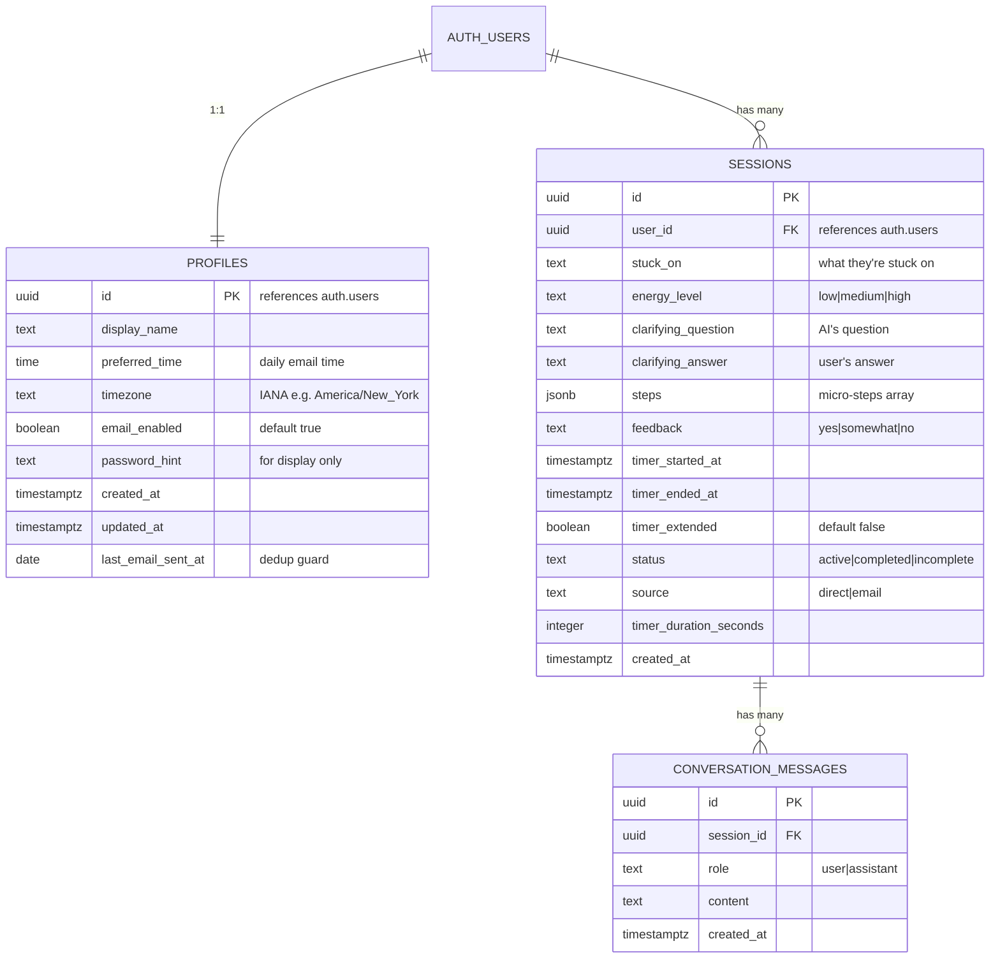

# feat: Build Unstuck Sensei MVP

## Overview

Build the complete MVP for Unstuck Sensei — a session-based AI coaching tool that helps solo founders get unstuck and start working in under 2 minutes. The MVP includes the core coaching session flow, user auth, session memory/history, a 25-minute work timer, and a daily email trigger to drive retention.

**Source documents:**
- `C1_MVP_Scope_AI_Start_Coach.docx` — original product spec
- `docs/brainstorms/2026-03-12-unstuck-sensei-mvp-brainstorm.md` — refined brainstorm with all decisions

## Problem Statement / Motivation

Solo founders know what they need to do but struggle to start. The gap between knowing and doing is where most productivity is lost. Validation showed moderate interest in the concept, but the primary objection was **"not sure I'd use it regularly"** — meaning the value prop resonates but the product needs a habit trigger to survive past novelty.

The MVP tests two hypotheses:
1. Does a structured AI coaching session make founders more likely to start working on a stuck task?
2. Does a daily email trigger improve retention over pure on-demand usage?

## Proposed Solution

A Next.js web app with Supabase backend, Claude Haiku 4.5 for AI coaching, and Resend for daily trigger emails. The core experience is a 6-step linear flow that takes under 3 minutes: state what you're stuck on → energy check → AI decomposes into micro-steps → confirm → start 25-min timer → check-in.

## Technical Approach

### Architecture

```
┌─────────────────────────────────────────────────────┐
│                    Vercel (Hosting)                  │
│                                                     │
│  ┌──────────────┐  ┌──────────────┐  ┌───────────┐ │
│  │  Next.js App  │  │  API Routes  │  │  Cron Job │ │
│  │  (App Router) │  │  /api/chat   │  │  /api/cron│ │
│  │  + Tailwind   │  │  (streaming) │  │  (email)  │ │
│  └──────┬───────┘  └──────┬───────┘  └─────┬─────┘ │
│         │                 │                │        │
└─────────┼─────────────────┼────────────────┼────────┘
          │                 │                │
    ┌─────▼─────┐    ┌─────▼─────┐   ┌─────▼─────┐
    │ Supabase  │    │  Claude   │   │  Resend   │
    │ Auth + DB │    │  Haiku    │   │  (Email)  │
    │ (Postgres)│    │  4.5 API  │   │           │
    └───────────┘    └───────────┘   └───────────┘
```

**Key architectural decisions:**
- **Next.js App Router** with route groups: `(auth)` for login/signup, `(app)` for authenticated pages
- **Server Actions** for mutations (session creation, feedback, settings updates)
- **API Route** for Claude streaming (`/api/chat/route.ts`) — Server Actions don't support streaming
- **API Route** for cron job (`/api/cron/daily-email/route.ts`) — Vercel Cron hits this every 15 min
- **Three Supabase clients**: server (Server Components/Actions), middleware (token refresh), browser (Client Components)
- **RLS on all tables** with service role key only for cron job (admin operations)

### Data Model



**Key schema notes:**
- `steps` stored as JSONB: `[{"order": 1, "text": "...", "started": false}]` — avoids a join table for MVP
- `profiles` created automatically via database trigger on `auth.users` insert
- `last_email_sent_at` on profiles prevents duplicate emails within the same day
- `status` on sessions tracks: `active` (in progress), `completed` (check-in done), `incomplete` (abandoned mid-timer)
- `source` tracks whether session started from email CTA or direct access (for measuring email → session conversion)

### Project Structure

```
app/
  (auth)/
    login/page.tsx              # Email/password + magic link login
    signup/page.tsx             # Signup with time picker onboarding
    auth/callback/route.ts      # OAuth/magic link callback
  (app)/
    layout.tsx                  # Authenticated layout with minimal nav
    session/
      page.tsx                  # Main session flow (the core product)
    session/[id]/page.tsx       # View past session (read-only)
    history/page.tsx            # Session history list
    settings/page.tsx           # Email prefs, name, password
    onboarding/page.tsx         # Post-signup time picker (if skipped)
  api/
    chat/route.ts               # Claude streaming endpoint
    cron/daily-email/route.ts   # Vercel Cron: daily email sender
  layout.tsx                    # Root layout
  page.tsx                      # Landing/marketing page (public)
lib/
  supabase/
    server.ts                   # Server-side Supabase client
    client.ts                   # Browser-side Supabase client
    middleware.ts               # Middleware Supabase client (token refresh)
    admin.ts                    # Service role client (cron job only)
  prompts/
    session.ts                  # System prompt + context builder
  database.types.ts             # Auto-generated from Supabase schema
hooks/
  useChat.ts                    # Client-side streaming hook
  useTimer.ts                   # Timer logic with notification support
components/
  session/
    StuckInput.tsx              # "What are you stuck on?" input
    EnergySelector.tsx          # Low/Medium/High buttons
    ClarifyingQuestion.tsx      # AI question + user answer
    StepsList.tsx               # Micro-steps display with reorder
    Timer.tsx                   # 25-min countdown + extension
    CheckIn.tsx                 # "Did you get started?" feedback
  ui/
    Button.tsx                  # Shared button component
    Input.tsx                   # Shared input component
    Card.tsx                    # Shared card component
middleware.ts                   # Root middleware (auth token refresh)
vercel.json                     # Cron job config
```

### Implementation Phases

---

#### Phase 1: Foundation (Days 1–3)

Project scaffolding, auth, database, and basic infrastructure. Goal: a deployed app where you can sign up, log in, and see a blank authenticated page.

**Tasks:**

- [ ] Initialize Next.js project with App Router, TypeScript, Tailwind CSS, ESLint
  - `npx create-next-app@latest . --typescript --tailwind --eslint --app --src-dir=false`
  - Files: `package.json`, `tsconfig.json`, `tailwind.config.ts`, `next.config.ts`
- [ ] Initialize git repo, create `.gitignore` (Node, Next.js, `.env*`, `.DS_Store`)
- [ ] Create `.env.local` and `.env.example` with required variables:
  ```
  NEXT_PUBLIC_SUPABASE_URL=
  NEXT_PUBLIC_SUPABASE_PUBLISHABLE_KEY=
  SUPABASE_SERVICE_ROLE_KEY=
  ANTHROPIC_API_KEY=
  RESEND_API_KEY=
  CRON_SECRET=
  NEXT_PUBLIC_SITE_URL=http://localhost:3000
  ```
- [ ] Create Supabase project (supabase.com dashboard)
- [ ] Set up database schema: `profiles`, `sessions`, `conversation_messages` tables with RLS policies
  - File: SQL migration in Supabase dashboard or `supabase/migrations/`
  - Include the `handle_new_user()` trigger for auto-creating profiles on signup
- [ ] Install `@supabase/ssr` and create three client variants:
  - `lib/supabase/server.ts` — for Server Components and Server Actions
  - `lib/supabase/client.ts` — for Client Components (browser)
  - `lib/supabase/middleware.ts` — for middleware (token refresh)
  - `lib/supabase/admin.ts` — service role client for cron job
- [ ] Create root `middleware.ts` for auth token refresh on every request
- [ ] Build auth pages:
  - `app/(auth)/signup/page.tsx` — email, password, "When do you usually start work?" time picker
  - `app/(auth)/login/page.tsx` — email/password login + magic link option
  - `app/(auth)/auth/callback/route.ts` — handles magic link and email confirmation redirects
- [ ] Configure Supabase Auth: enable email/password + magic link, set redirect URLs
- [ ] Set up Supabase long-lived sessions (increase JWT expiry or rely on refresh token — default refresh token lasts 1 week, extend to 30 days in Supabase dashboard > Authentication > Sessions)
- [ ] Build minimal authenticated layout `app/(app)/layout.tsx` with simple nav (session, history, settings links)
- [ ] Create `app/page.tsx` — simple landing page with signup CTA
- [ ] Deploy to Vercel, connect to Git repo, set environment variables
- [ ] Generate TypeScript types from Supabase schema: `npx supabase gen types typescript`
  - File: `lib/database.types.ts`
- [ ] Create `CLAUDE.md` at project root documenting conventions, stack decisions, and file structure

**Success criteria:** Can sign up, log in (email/password and magic link), see an authenticated home page, and the onboarding time picker saves to the profiles table. Deployed and accessible via a Vercel URL.

---

#### Phase 2: Core Session Flow (Days 4–7)

The heart of the product. Goal: a user can complete a full coaching session end-to-end.

**Tasks:**

- [ ] Build the session page `app/(app)/session/page.tsx` as a stateful client component managing the 6-step flow
- [ ] Implement Step 1: "What are you stuck on?" input
  - `components/session/StuckInput.tsx`
  - For returning users: fetch and display context note from last session (task + feedback)
  - Entry point logic: if `?source=email` param, track as email-sourced session
- [ ] Implement Step 2: Energy selector
  - `components/session/EnergySelector.tsx`
  - Three big buttons: Low / Medium / High — single tap, no explanation needed
- [ ] Create the Claude streaming endpoint `app/api/chat/route.ts`
  - Install `@anthropic-ai/sdk`
  - Auth check via `supabase.auth.getUser()` before calling Claude
  - Fetch last 3–5 sessions for context injection
  - Build system prompt in `lib/prompts/session.ts` with coaching persona + energy awareness
  - Stream response back as ReadableStream
  - Error handling: auto-retry once on failure, then return friendly error
  - Cap `max_tokens` at 1024
- [ ] Create the client-side streaming hook `hooks/useChat.ts`
  - Manages streaming state, accumulated response, and error state
- [ ] Implement Step 3: AI interaction (chat-like, single screen)
  - `components/session/ClarifyingQuestion.tsx`
  - AI response streams in. If it's a clarifying question, show answer input below
  - If AI goes straight to steps, render them directly
  - Handle the case where AI asks a question: user answers → second API call → steps generated
  - Loading state during AI call (subtle pulsing indicator, not a spinner)
- [ ] Parse AI response into structured steps
  - Extract numbered list from AI text response
  - Store as JSONB array in session record
- [ ] Implement Step 4: Steps confirmation and reorder
  - `components/session/StepsList.tsx`
  - Display 3–5 micro-steps as a list
  - Up/down arrow buttons for reorder (works on mobile, unlike drag-and-drop)
  - "Try again" button for re-decomposition (same input, new API call)
  - Implicit confirm: clicking "Start working on [first step]" confirms the list
- [ ] Save partial session data at each step:
  - After Step 1: save `stuck_on` to new session record (status: `active`)
  - After Step 2: update with `energy_level`
  - After Step 3: update with `clarifying_question`, `clarifying_answer`, `steps`
  - This ensures abandoned sessions are preserved for drop-off analysis
- [ ] Store conversation messages in `conversation_messages` table after each AI response

**Success criteria:** A user can enter what they're stuck on, select energy, receive AI-generated micro-steps (streamed), reorder them, and proceed to the "Start working" button. All data persisted to Supabase.

---

#### Phase 3: Timer + Check-in (Days 7–9)

Complete the session flow with the work timer and feedback collection.

**Tasks:**

- [ ] Implement the 25-minute countdown timer
  - `components/session/Timer.tsx` + `hooks/useTimer.ts`
  - Use `Date.now()` comparison (not `setInterval` counting) for accuracy across tab switches
  - Record `timer_started_at` in session when timer starts
  - Display: large countdown (MM:SS), first step text as reminder, manual stop button
- [ ] Request browser notification permission on first timer start
  - If granted: send notification + play gentle chime when timer ends
  - If denied: change tab title to "Time's up! - Unstuck Sensei" and play sound
  - Store permission state in localStorage to avoid re-prompting
- [ ] Implement timer extension flow
  - When timer ends: "Want to keep going?" with Extend (+25 min) and "Done" buttons
  - If extended: set `timer_extended = true`, restart countdown for 25 more min
  - Max 1 extension (50 min total cap)
- [ ] Implement Step 6: Post-session check-in
  - `components/session/CheckIn.tsx`
  - "Did you get started?" — three buttons: Yes / Somewhat / No
  - Save feedback + `timer_ended_at` + `timer_duration_seconds` to session
  - Update session status to `completed`
  - Brief positive message after feedback: "Nice work showing up today." (regardless of answer — no guilt)
- [ ] Handle mid-timer abandonment
  - Use `beforeunload` event to save session as `incomplete` when browser closes during timer
  - When returning user has an `active` session: show option to resume or start fresh
  - `incomplete` sessions still count for history and pattern data
- [ ] Implement "home state" logic for `app/(app)/session/page.tsx`:
  - If `?source=email`: go straight to "What are you stuck on?" input
  - If direct access: show simple hub — greeting, last session summary card, "Start new session" button, link to history

**Success criteria:** Full session flow works end-to-end including timer with notifications, extension, check-in, and proper handling of abandoned sessions. Different entry points (email vs direct) route correctly.

---

#### Phase 4: Session History + Settings (Days 9–11)

Give users visibility into their past sessions and control over email preferences.

**Tasks:**

- [ ] Build session history page `app/(app)/history/page.tsx`
  - List view: date, task (truncated), energy level badge, feedback badge, source badge
  - Most recent first
  - Empty state: "No sessions yet. Start your first one!" with CTA button
  - Use `force-dynamic` to prevent caching issues
- [ ] Build session detail view `app/(app)/session/[id]/page.tsx`
  - Read-only view of: stuck_on, energy level, clarifying Q&A, all micro-steps, feedback, timer duration
  - Back button to history
  - RLS ensures users can only view their own sessions
- [ ] Build settings page `app/(app)/settings/page.tsx`
  - Daily email toggle (on/off)
  - Email time picker (same component as onboarding)
  - Display name field
  - Password change (Supabase built-in `updateUser`)
  - All updates via Server Actions
  - Call `revalidatePath('/settings')` after saves
- [ ] Add navigation to authenticated layout
  - Minimal top nav: "New Session" | "History" | "Settings"
  - Active state on current page
  - App name/logo

**Success criteria:** Users can browse past sessions, view details, and manage their email preferences and account settings.

---

#### Phase 5: Daily Email Trigger (Days 11–13)

The retention mechanism — daily emails at the user's chosen time.

**Tasks:**

- [ ] Set up Resend: create account, verify sending domain (DNS: SPF, DKIM, DMARC records)
  - Install `resend` npm package
- [ ] Build the cron endpoint `app/api/cron/daily-email/route.ts`
  - Authenticate via `CRON_SECRET` header (Vercel sends this)
  - Use `supabaseAdmin` (service role) to query all users with `email_enabled = true`
  - Filter users whose local time (based on stored IANA timezone) falls within the current 15-min window
  - Check `last_email_sent_at` to prevent duplicate sends
  - For each matching user:
    - Check if they have a completed session today (in their timezone)
    - Send appropriate email variant:
      - No session today: "Hey! What's the one thing you're putting off today? Let's tackle it together. [CTA link with ?source=email]"
      - Session done: "Nice work today! See you tomorrow."
    - Update `last_email_sent_at`
  - Use `Promise.allSettled` to handle partial failures gracefully
  - Log results for debugging
- [ ] Configure Vercel Cron in `vercel.json`: run every 15 minutes (`*/15 * * * *`)
- [ ] Add unsubscribe handling:
  - Email footer: "Don't want these? Update your preferences: [settings link]"
  - Clicking goes to settings page with email toggle
- [ ] Add `?source=email` tracking: when session page loads with this param, set `source: 'email'` on the new session record

**Success criteria:** Daily emails send at the correct time per user's timezone, with context-aware content. No duplicate emails. Unsubscribe works. Email → session conversion is trackable.

---

#### Phase 6: Landing Page + Polish + Deploy (Days 13–15)

Marketing entry point, responsive design, and production readiness.

**Tasks:**

- [ ] Build landing page `app/page.tsx`
  - Headline: "Get unstuck and start working — in 2 minutes"
  - Brief explanation of the 6-step flow
  - Social proof placeholder (for beta testimonials later)
  - CTA: "Start your first session — free" → signup page
  - No complex design — clean, focused, fast-loading
- [ ] Responsive design pass on all pages
  - Session flow must work well on mobile (the primary use case from email CTA)
  - Energy selector: large touch targets
  - Step reorder: up/down buttons (not drag-and-drop) work well on mobile
  - Timer: large, readable countdown
- [ ] Add PostHog analytics (or Plausible)
  - Install and configure
  - Track key events: session_started, session_completed, timer_started, timer_extended, checkin_submitted, email_cta_clicked
  - Set up funnels for: signup → first session → return session
- [ ] SEO basics: meta tags, Open Graph, page titles
- [ ] Error boundary for the session flow — if something crashes, show a friendly message, not a white screen
- [ ] PWA basics: `manifest.json` and service worker for "Add to Home Screen" on mobile
- [ ] Production deployment checklist:
  - All env vars set in Vercel
  - Supabase redirect URLs include production domain
  - Resend domain verified
  - Cron job active
  - Custom domain connected (if ready)

**Success criteria:** Production-ready MVP deployed with a marketing landing page. Works on desktop and mobile. Key metrics tracked. Ready for beta testers.

---

## Acceptance Criteria

### Functional Requirements

- [ ] User can sign up with email + password and set their preferred daily email time
- [ ] User can log in with email/password or magic link
- [ ] Auth sessions persist for 30+ days (long-lived refresh tokens)
- [ ] User can complete the full 6-step coaching session in under 3 minutes
- [ ] AI generates 3–5 energy-appropriate micro-steps via Claude Haiku 4.5 (streamed)
- [ ] AI asks at most 1 clarifying question before decomposition
- [ ] User can reorder and re-request micro-steps
- [ ] 25-minute countdown timer works correctly, even when tab is backgrounded
- [ ] Browser notification + sound fires when timer ends
- [ ] User can extend timer once (+25 min, 50 min max)
- [ ] Post-session check-in (Yes/Somewhat/No) is collected and saved
- [ ] Partial sessions are saved at each step (for drop-off analysis)
- [ ] Incomplete sessions (browser closed mid-timer) are saved with "incomplete" status
- [ ] Session history shows all past sessions, clickable for detail view
- [ ] Daily email sends at user's chosen time (±15 min window)
- [ ] Email content adapts: nudge if no session today, reinforcement if session done
- [ ] User can disable daily emails and change preferred time in settings
- [ ] Email CTA drops user straight into session (leveraging long-lived auth session)
- [ ] Entry point context: email CTA → session start; direct access → hub screen
- [ ] AI tone is warm, peer-like, no productivity jargon, no guilt

### Non-Functional Requirements

- [ ] Session flow completes in under 3 minutes (speed is a feature)
- [ ] AI response streams within 2–3 seconds
- [ ] Auto-retry once on AI failure, then show friendly error with manual retry
- [ ] Works on mobile browsers (responsive, touch-friendly)
- [ ] All user data protected by Supabase RLS policies
- [ ] Service role key never exposed to client
- [ ] No productivity jargon in any user-facing copy
- [ ] Plain text emails (not HTML) for deliverability

### Quality Gates

- [ ] All Supabase RLS policies tested (user can only access own data)
- [ ] Auth flow tested: signup, login, magic link, session expiry, token refresh
- [ ] Timer accuracy tested across tab switches and mobile browsers
- [ ] Cron job tested: correct timezone filtering, dedup, email variant selection
- [ ] AI error handling tested: timeout, rate limit, API down scenarios
- [ ] Mobile responsive: tested on iOS Safari and Android Chrome
- [ ] Lighthouse score > 80 on landing page

## Success Metrics

| Phase | Metric | Target |
|-------|--------|--------|
| Week 1–4 | Return rate (2+ sessions) | 30%+ |
| Week 1–4 | "Did this help?" yes rate | 60%+ |
| Week 1–4 | "Start working" click rate | 50%+ |
| Week 1–4 | Email open rate | 40%+ |
| Week 1–4 | Email → session conversion | 15%+ |
| Month 2–3 | Weekly active users | 200+ |
| Month 2–3 | Free-to-paid conversion | 5–10% (Tier 2) |

## Kill Criteria

After 6 weeks with 200+ signups: if return rate < 15% AND "Did this help?" yes rate < 40%, the core hypothesis is invalidated. Pivot or exit.

## Dependencies & Prerequisites

| Dependency | Setup Required | Blocking Phase |
|-----------|----------------|----------------|
| Supabase project | Create project, get API keys | Phase 1 |
| Anthropic API key | Create account, get API key | Phase 2 |
| Resend account | Create account, verify domain (DNS) | Phase 5 |
| Vercel account | Connect to Git repo | Phase 1 |
| Custom domain | Purchase + DNS config | Phase 6 (optional) |

## Risk Analysis & Mitigation

| Risk | Likelihood | Impact | Mitigation |
|------|-----------|--------|------------|
| AI generates poor/irrelevant steps | Medium | High — breaks core value | Invest in prompt iteration. Use beta testers for rapid feedback. Log all sessions for review. |
| Timer unreliable on mobile browsers | Medium | Medium — degrades experience | Use `Date.now()` comparison, not intervals. Test on iOS Safari + Android Chrome early. |
| Daily emails land in spam/promotions | Medium | High — kills retention lever | Plain text only. Verify sending domain. Personal "from" name. Test with multiple email providers. |
| Supabase free tier limits hit | Low | Low — cheap to upgrade | Free tier is generous (500MB DB, 50K auth users). Upgrade to Pro ($25/mo) when needed. |
| Claude API downtime | Low | High — product non-functional | Auto-retry once. Friendly error message. Monitor Anthropic status page. No fallback model for MVP (not worth the complexity). |

## Key Technical Patterns (from research)

### Supabase Client Setup
- Use `@supabase/ssr` (NOT deprecated `@supabase/auth-helpers-nextjs`)
- Three client variants: server, middleware, browser
- Always use `getUser()` on server (verifies token), never `getSession()` alone
- `cookies()` is async in Next.js 15+ — must `await`

### Auth Best Practices
- Configure redirect URLs in Supabase dashboard (localhost + production)
- Magic link rate limit: 1 per 60s per email by default
- Profile auto-creation via database trigger on `auth.users` insert
- Long-lived sessions: extend refresh token expiry to 30 days

### Claude Integration
- API Route for streaming (not Server Action)
- Install `@anthropic-ai/sdk`
- Cap `max_tokens` at 1024
- Store prompts in `lib/prompts/session.ts`, not inline
- Inject only last 3–5 sessions as structured context
- Handle `RateLimitError` and `APIError` specifically

### Email Scheduling
- Vercel Cron every 15 min → query users whose local time is in window
- Store IANA timezone names (not UTC offsets) — DST-safe
- `last_email_sent_at` column prevents duplicate sends
- Service role key required (bypasses RLS to query all users)

### Caching
- Call `revalidatePath()` after Server Action mutations
- Use `force-dynamic` on pages that must always be fresh (history, settings)

## Prompt Architecture

### System Prompt (stored in `lib/prompts/session.ts`)

```
You are Unstuck Sensei, a warm and supportive peer coach for solo founders.

Your tone: casual, encouraging, like a supportive friend. Use "we" and "let's" language.
Never use productivity jargon (no "deep work", "time blocking", "eat the frog").
Never shame or guilt. Every session starts fresh.

Your job in this session:
1. If the user's input is vague, ask ONE clarifying question (max one).
2. Then decompose their task into 3-5 concrete micro-steps.
3. Sequence steps based on their energy level: {energy_level}.
   - Low energy: start with the easiest, most mechanical step
   - Medium energy: balanced sequence
   - High energy: start with the hardest/most impactful step

Output the steps as a numbered list. Each step should be specific enough to start
immediately and completable in 5-15 minutes.

Keep all responses under 150 words. Founders are impatient. Get to the steps fast.
```

### Per-Session Context Injection

Before each session, inject the last 3–5 sessions as structured text:

```
Recent sessions for context:
- 2026-03-11: Stuck on "writing the pricing page" (energy: low). Feedback: yes
- 2026-03-10: Stuck on "deciding on a marketing channel" (energy: medium). Feedback: somewhat
- 2026-03-08: Stuck on "writing the pricing page" (energy: high). Feedback: yes
```

This makes session #5 feel fundamentally different from session #1 — the key differentiator vs. ChatGPT.

## What's NOT in MVP

- Google Calendar integration (Tier 2)
- Personalized session openers based on patterns (Tier 2)
- Paywall / pricing / Stripe (Tier 2)
- Weekly momentum email (Tier 2)
- Post-session rating beyond yes/somewhat/no (Tier 2)
- Smart nudges based on detected patterns (Tier 2)
- Community features (Tier 3)
- Slack bot (Tier 3)
- Notion/Todoist import (Tier 3)
- Native mobile app (Tier 3)
- Voice interface (Tier 3)

## References & Research

### Brainstorm Document
- `docs/brainstorms/2026-03-12-unstuck-sensei-mvp-brainstorm.md`

### Original Spec
- `C1_MVP_Scope_AI_Start_Coach.docx`

### Key Documentation
- Supabase SSR docs: `@supabase/ssr` package for Next.js App Router
- Anthropic SDK: `@anthropic-ai/sdk` for streaming with Claude
- Resend docs: plain text email sending + domain verification
- Vercel Cron: `vercel.json` cron configuration
- Next.js App Router: route groups, Server Actions, middleware patterns
