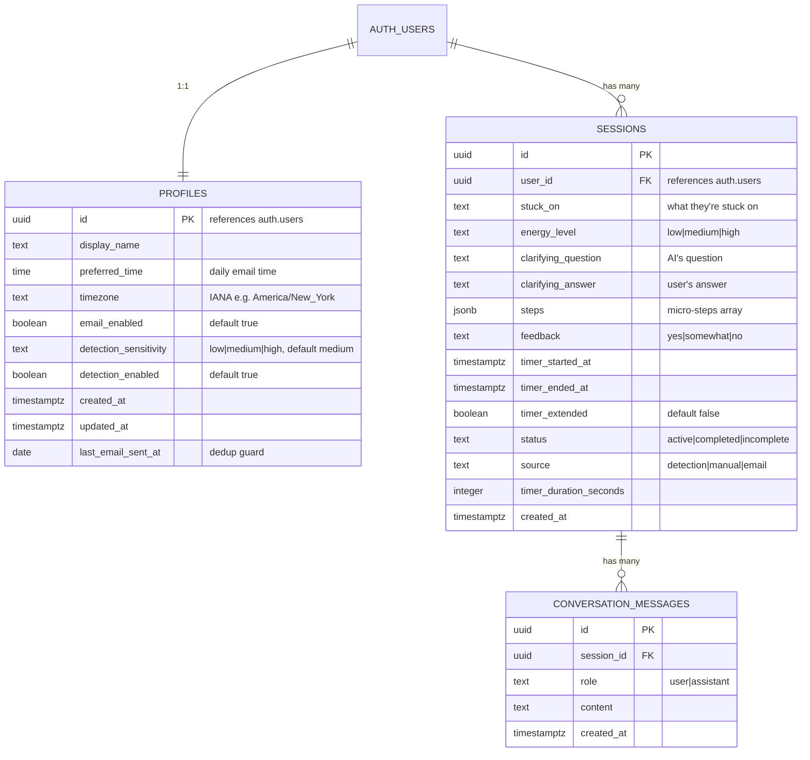

# feat: Unstuck Sensei Phase 1 — Tauri + Auth + Tray Foundation

## Overview

Build the foundation layer of Unstuck Sensei as a Tauri v2 desktop app. By the end of this phase: the app launches, sits in the system tray, the user can sign up/in with email + password, the window hides to tray on close, and the app auto-launches on login.

**Parent plan:** `docs/plans/2026-03-14-feat-unstuck-sensei-tauri-desktop-mvp-plan.md`

**Starting point:** Zero code exists. This phase starts from `npm create tauri-app`.

**Development platform:** macOS first. Windows-specific behavior (single-instance plugin for deep links) is configured in code but tested later.

## Technical Approach

### Architecture (Phase 1 Scope)

```
┌──────────────────────────────────────────────────┐
│            Tauri v2 Desktop App                   │
│                                                   │
│  ┌──────────────┐  ┌──────────────────────────┐  │
│  │  React UI    │  │  Rust Backend             │  │
│  │  (WebView)   │  │                           │  │
│  │  Vite +      │  │  - System tray + menu     │  │
│  │  React +     │  │  - Window management      │  │
│  │  Tailwind    │  │  - Auto-launch            │  │
│  │  + RR v7     │  │  - Deep link handler      │  │
│  └──────┬───────┘  └──────────┬───────────────┘  │
│         │  invoke / listen    │                   │
│         ├─────────────────────┤                   │
└─────────┼─────────────────────┼───────────────────┘
          │                     │
    ┌─────▼─────┐
    │ Supabase  │
    │ Auth + DB │
    │ (Postgres)│
    │ Direct    │
    │ from      │
    │ client    │
    └───────────┘
```

### Key Technical Decisions from Research

| Decision | Choice | Why |
|---|---|---|
| Auth flow | PKCE via system browser + deep link callback | Only secure option for desktop apps; implicit flow leaks tokens |
| Token storage | `tauri-plugin-secure-storage` (OS keychain) | `tauri-plugin-store` is plaintext JSON; `tauri-plugin-stronghold` is deprecated (removed in v3) |
| Supabase client storage | Custom adapter wiring secure-storage into Supabase's `storage` option | Supabase auto-handles refresh + persistence transparently |
| Window close behavior | `prevent_close()` + `window.hide()` | Tray app must stay running; "Quit" in tray menu calls `app.exit(0)` |
| Initial window visibility | `"visible": true` in tauri.conf.json, hide on `--minimized` flag | First launch shows login; auto-start launches hidden to tray |
| Frontend routing | React Router v7 declarative mode (`BrowserRouter`) | No SSR needed; framework mode is overkill for Tauri |
| RLS performance | `(SELECT auth.uid())` wrapper in all policies | Prevents per-row function calls; up to 100x faster on large tables |
| Deep links (Windows) | `tauri-plugin-deep-link` + `tauri-plugin-single-instance` | Windows spawns new instance on deep link; single-instance forwards to existing |
| Tauri v2 permissions | Capabilities system (`src-tauri/capabilities/`) | v2 replaces v1 allowlist; all plugin commands blocked by default |

### Data Model



### Project Structure (Phase 1)

```
unstuck-sensei/
  src-tauri/
    src/
      lib.rs                          # Tauri app builder, plugins, tray, window events
      main.rs                         # Entry point (calls lib::run)
    capabilities/
      default.json                    # Plugin permissions
    icons/
      tray-icon.png                   # 32x32 tray icon
      32x32.png
      128x128.png
      icon.icns                       # macOS
      icon.ico                        # Windows
    tauri.conf.json
    Cargo.toml

  src/
    main.tsx                          # React entry point + BrowserRouter
    App.tsx                           # Routes definition
    pages/
      Login.tsx                       # Email/password sign-in + sign-up + magic link
    components/
      Layout.tsx                      # Authenticated layout with nav (Session, History, Settings)
      ProtectedRoute.tsx              # Auth guard — redirects to /login if no session
    hooks/
      useAuth.ts                      # Supabase auth state, login/logout, deep link handler
    lib/
      supabase.ts                     # Supabase client with secure-storage adapter
      database.types.ts               # Generated types from Supabase schema

  .env.example
  .gitignore
  package.json
  vite.config.ts
  tsconfig.json
  CLAUDE.md
```

## Implementation Phases

### Step 1: Project Scaffolding (Day 1 morning)

Initialize the Tauri v2 project with all tooling.

**Tasks:**

- [x] Run `npm create tauri-app@latest` with React + TypeScript template
- [x] Install frontend dependencies:
  ```bash
  npm install react-router @supabase/supabase-js
  npm install -D tailwindcss @tailwindcss/vite
  ```
- [x] Configure Tailwind CSS via Vite plugin in `vite.config.ts`:
  ```typescript
  // vite.config.ts
  import { defineConfig } from 'vite';
  import react from '@vitejs/plugin-react';
  import tailwindcss from '@tailwindcss/vite';

  export default defineConfig({
    plugins: [react(), tailwindcss()],
    clearScreen: false,
    server: {
      port: 1420,
      strictPort: true,
      watch: { ignored: ['**/src-tauri/**'] },
    },
    envPrefix: ['VITE_', 'TAURI_'],
    build: {
      target: ['es2021', 'chrome100', 'safari13'],
      minify: !process.env.TAURI_DEBUG ? 'esbuild' : false,
      sourcemap: !!process.env.TAURI_DEBUG,
    },
  });
  ```
- [x] Add `@import "tailwindcss"` to `src/main.css`
- [x] Initialize git repo, create `.gitignore`:
  ```
  # Node
  node_modules/
  dist/

  # Rust
  src-tauri/target/

  # Environment
  .env
  .env.local

  # OS
  .DS_Store
  Thumbs.db

  # IDE
  .vscode/
  .idea/
  ```
- [x] Create `.env.example`:
  ```
  VITE_SUPABASE_URL=
  VITE_SUPABASE_PUBLISHABLE_KEY=
  ```
- [ ] Verify `npm run tauri dev` launches successfully

**Success criteria:** Tauri dev mode launches a window with React + Tailwind working.

---

### Step 2: Rust Backend — Tray, Window Management, Plugins (Day 1 afternoon)

Set up the system tray, window hide-to-tray, auto-launch, and deep link handling.

**Tasks:**

- [x] Add Rust dependencies to `src-tauri/Cargo.toml`:
  ```toml
  [dependencies]
  tauri = { version = "2", features = ["tray-icon"] }
  tauri-plugin-deep-link = "2"
  tauri-plugin-autostart = "2"
  tauri-plugin-store = "2"
  tauri-plugin-secure-storage = "2"
  tauri-plugin-shell = "2"
  tauri-plugin-single-instance = "2"
  serde = { version = "1", features = ["derive"] }
  serde_json = "1"
  ```
- [x] Add corresponding npm packages:
  ```bash
  npm install @tauri-apps/plugin-deep-link @tauri-apps/plugin-autostart @tauri-apps/plugin-store @tauri-apps/plugin-shell
  ```
- [x] Build system tray in `src-tauri/src/lib.rs`:
  - Menu items: "Start Session", "Pause Detection" (disabled in Phase 1), separator, "Settings", "Quit"
  - Left-click tray icon → toggle window show/hide
  - "Quit" → `app.exit(0)`
  - "Start Session" → show window + navigate to session page (Phase 3)
- [x] Implement hide-to-tray on window close:
  ```rust
  .on_window_event(|window, event| {
      if let tauri::WindowEvent::CloseRequested { api, .. } = event {
          api.prevent_close();
          window.hide().unwrap();
      }
  })
  ```
- [x] Register all plugins in the builder chain:
  ```rust
  tauri::Builder::default()
      .plugin(tauri_plugin_deep_link::init())
      .plugin(tauri_plugin_autostart::init(
          tauri_plugin_autostart::MacosLauncher::LaunchAgent,
          Some(vec!["--minimized"]),
      ))
      .plugin(tauri_plugin_store::Builder::default().build())
      .plugin(tauri_plugin_secure_storage::init())
      .plugin(tauri_plugin_shell::init())
      .plugin(tauri_plugin_single_instance::init(|app, _args, _cwd| {
          // On second instance (Windows deep link): show the existing window
          if let Some(w) = app.get_webview_window("main") {
              w.show().unwrap();
              w.set_focus().unwrap();
          }
      }))
  ```
- [x] Configure `tauri.conf.json`:
  - `productName`: "Unstuck Sensei"
  - `identifier`: "com.unstucksensei.app"
  - Window: `visible: true`, `width: 420`, `height: 680`, `title: "Unstuck Sensei"`
  - Handle `--minimized` flag in Rust setup: if present, hide the window immediately after creation (for auto-start scenarios). Otherwise, show it (for normal launches and first-time users).
  - CSP: `"default-src 'self'; connect-src 'self' https://*.supabase.co; style-src 'self' 'unsafe-inline'"`
  - Deep link scheme: `unstuck-sensei`
- [x] Create `src-tauri/capabilities/default.json`:
  ```json
  {
    "identifier": "default",
    "description": "Default capabilities for Unstuck Sensei",
    "windows": ["main"],
    "permissions": [
      "core:default",
      "shell:allow-open",
      "deep-link:default",
      "autostart:allow-enable",
      "autostart:allow-disable",
      "autostart:allow-is-enabled",
      "store:default",
      "secure-storage:allow-get",
      "secure-storage:allow-set",
      "secure-storage:allow-delete"
    ]
  }
  ```
- [x] Verify: app launches to tray, window hides on close, "Quit" exits

**Success criteria:** App sits in system tray. Closing window hides it. Tray menu works. Quit actually exits.

---

### Step 3: Supabase Project + Database Schema (Day 2 morning)

Create the Supabase project and set up all tables with RLS.

**Tasks:**

- [ ] Create Supabase project in dashboard
- [ ] Copy `SUPABASE_URL` and the publishable client key to `.env`
- [ ] Run SQL migration to create tables:

```sql
-- ============================================
-- PROFILES
-- ============================================
CREATE TABLE public.profiles (
  id UUID PRIMARY KEY REFERENCES auth.users(id) ON DELETE CASCADE,
  display_name TEXT,
  preferred_time TIME DEFAULT '09:00:00',
  timezone TEXT DEFAULT 'America/New_York',
  email_enabled BOOLEAN DEFAULT TRUE,
  detection_sensitivity TEXT DEFAULT 'medium'
    CHECK (detection_sensitivity IN ('low', 'medium', 'high')),
  detection_enabled BOOLEAN DEFAULT TRUE,
  created_at TIMESTAMPTZ DEFAULT NOW(),
  updated_at TIMESTAMPTZ DEFAULT NOW(),
  last_email_sent_at DATE
);

-- RLS
ALTER TABLE public.profiles ENABLE ROW LEVEL SECURITY;

CREATE POLICY "Users can view own profile"
  ON public.profiles FOR SELECT
  TO authenticated
  USING (id = (SELECT auth.uid()));

CREATE POLICY "Users can update own profile"
  ON public.profiles FOR UPDATE
  TO authenticated
  USING (id = (SELECT auth.uid()))
  WITH CHECK (id = (SELECT auth.uid()));

-- No INSERT policy needed — trigger handles creation
-- No DELETE policy — account deletion handled via Supabase auth admin

-- ============================================
-- SESSIONS
-- ============================================
CREATE TABLE public.sessions (
  id UUID PRIMARY KEY DEFAULT gen_random_uuid(),
  user_id UUID NOT NULL REFERENCES auth.users(id) ON DELETE CASCADE,
  stuck_on TEXT,
  energy_level TEXT CHECK (energy_level IN ('low', 'medium', 'high')),
  clarifying_question TEXT,
  clarifying_answer TEXT,
  steps JSONB,
  feedback TEXT CHECK (feedback IN ('yes', 'somewhat', 'no')),
  timer_started_at TIMESTAMPTZ,
  timer_ended_at TIMESTAMPTZ,
  timer_extended BOOLEAN DEFAULT FALSE,
  status TEXT DEFAULT 'active'
    CHECK (status IN ('active', 'completed', 'incomplete')),
  source TEXT DEFAULT 'manual'
    CHECK (source IN ('detection', 'manual', 'email')),
  timer_duration_seconds INTEGER,
  created_at TIMESTAMPTZ DEFAULT NOW()
);

-- Performance index for RLS
CREATE INDEX idx_sessions_user_id ON public.sessions USING btree (user_id);

-- RLS
ALTER TABLE public.sessions ENABLE ROW LEVEL SECURITY;

CREATE POLICY "Users can view own sessions"
  ON public.sessions FOR SELECT
  TO authenticated
  USING (user_id = (SELECT auth.uid()));

CREATE POLICY "Users can insert own sessions"
  ON public.sessions FOR INSERT
  TO authenticated
  WITH CHECK (user_id = (SELECT auth.uid()));

CREATE POLICY "Users can update own sessions"
  ON public.sessions FOR UPDATE
  TO authenticated
  USING (user_id = (SELECT auth.uid()))
  WITH CHECK (user_id = (SELECT auth.uid()));

-- ============================================
-- CONVERSATION_MESSAGES
-- ============================================
CREATE TABLE public.conversation_messages (
  id UUID PRIMARY KEY DEFAULT gen_random_uuid(),
  session_id UUID NOT NULL REFERENCES public.sessions(id) ON DELETE CASCADE,
  role TEXT NOT NULL CHECK (role IN ('user', 'assistant')),
  content TEXT NOT NULL,
  created_at TIMESTAMPTZ DEFAULT NOW()
);

-- Performance index for RLS (join to sessions for user_id check)
CREATE INDEX idx_conversation_messages_session_id
  ON public.conversation_messages USING btree (session_id);

-- RLS
ALTER TABLE public.conversation_messages ENABLE ROW LEVEL SECURITY;

CREATE POLICY "Users can view own messages"
  ON public.conversation_messages FOR SELECT
  TO authenticated
  USING (session_id IN (
    SELECT id FROM public.sessions WHERE user_id = (SELECT auth.uid())
  ));

CREATE POLICY "Users can insert own messages"
  ON public.conversation_messages FOR INSERT
  TO authenticated
  WITH CHECK (session_id IN (
    SELECT id FROM public.sessions WHERE user_id = (SELECT auth.uid())
  ));

-- ============================================
-- AUTO-CREATE PROFILE ON SIGNUP
-- ============================================
CREATE OR REPLACE FUNCTION public.handle_new_user()
RETURNS TRIGGER
LANGUAGE plpgsql
SECURITY DEFINER
SET search_path = ''
AS $$
BEGIN
  INSERT INTO public.profiles (id, display_name)
  VALUES (
    NEW.id,
    COALESCE(NEW.raw_user_meta_data ->> 'display_name', split_part(NEW.email, '@', 1))
  );
  RETURN NEW;
END;
$$;

CREATE TRIGGER on_auth_user_created
  AFTER INSERT ON auth.users
  FOR EACH ROW
  EXECUTE FUNCTION public.handle_new_user();

-- ============================================
-- UPDATED_AT TRIGGER FOR PROFILES
-- ============================================
CREATE OR REPLACE FUNCTION public.update_updated_at()
RETURNS TRIGGER
LANGUAGE plpgsql
AS $$
BEGIN
  NEW.updated_at = NOW();
  RETURN NEW;
END;
$$;

CREATE TRIGGER profiles_updated_at
  BEFORE UPDATE ON public.profiles
  FOR EACH ROW
  EXECUTE FUNCTION public.update_updated_at();
```

- [ ] Configure Supabase Auth settings in dashboard:
  - **Email confirmation: OFF for dev** (faster iteration — no email verification needed to test). Add a pre-production checklist item to turn it ON.
  - **Verify refresh token rotation is enabled** (should be on by default)
  - **JWT expiry:** Keep default 3600s (1 hour) — Supabase auto-refreshes
  - **Add redirect URL:** `unstuck-sensei://auth/callback`
  - **Set Site URL:** `unstuck-sensei://auth/callback`
- [ ] **Pre-production checklist** (do before any real users):
  - Enable email confirmation in Supabase Auth settings
  - Verify RLS policies with a second test account
- [ ] Verify refresh token rotation: in Supabase dashboard > Auth > Settings, confirm "Refresh Token Rotation" is enabled. Test that using a refresh token invalidates the previous one.
- [x] Verify RLS by testing from the Supabase client (NOT SQL Editor — it bypasses RLS):
  - Unauthenticated request returns no data
  - Authenticated user can only see their own rows
  - Authenticated user cannot access another user's sessions

**Security checklist (from research):**
- [x] RLS enabled on ALL three tables
- [x] `(SELECT auth.uid())` wrapper used in all policies (performance)
- [x] Index on `user_id` column used in RLS policies
- [x] `SECURITY DEFINER` + `SET search_path = ''` on trigger function
- [x] `service_role` key NOT used anywhere in desktop app
- [x] `TO authenticated` clause on all policies (blocks anon access)
- [x] No reliance on `user_metadata` in RLS policies
- [x] Email confirmation configured for production

**Success criteria:** All tables created with RLS. Trigger creates profile on signup. Auth settings configured.

---

### Step 4: Supabase Client + Secure Token Storage (Day 2 afternoon)

Wire up the Supabase JS client with OS keychain storage.

**Tasks:**

- [x] Create `src/lib/supabase.ts` — Supabase client with secure-storage adapter:
  ```typescript
  // src/lib/supabase.ts
  import { createClient } from '@supabase/supabase-js';
  import { invoke } from '@tauri-apps/api/core';
  import type { Database } from './database.types';

  const supabaseUrl = import.meta.env.VITE_SUPABASE_URL;
  const supabasePublishableKey = import.meta.env.VITE_SUPABASE_PUBLISHABLE_KEY;

  // Custom storage adapter using OS keychain via tauri-plugin-secure-storage
  const secureStorage = {
    getItem: async (key: string): Promise<string | null> => {
      try {
        return await invoke<string>('plugin:secure-storage|get', { key });
      } catch {
        return null;
      }
    },
    setItem: async (key: string, value: string): Promise<void> => {
      await invoke('plugin:secure-storage|set', { key, value });
    },
    removeItem: async (key: string): Promise<void> => {
      try {
        await invoke('plugin:secure-storage|delete', { key });
      } catch {
        // Key may not exist — safe to ignore
      }
    },
  };

  export const supabase = createClient<Database>(supabaseUrl, supabasePublishableKey, {
    auth: {
      flowType: 'pkce',
      autoRefreshToken: true,
      persistSession: true,
      detectSessionInUrl: false, // We handle deep links manually
      storage: secureStorage,
    },
  });
  ```
- [ ] Generate TypeScript types from Supabase:
  ```bash
  npx supabase gen types typescript --project-id <project-id> > src/lib/database.types.ts
  ```
- [ ] Verify: Supabase client initializes without errors in dev mode

**Why `detectSessionInUrl: false`:** In a Tauri app, auth callbacks come via deep links (custom URL scheme), not browser URL changes. We handle the code exchange manually in the deep link handler.

**Success criteria:** Supabase client created with keychain-backed storage. Types generated.

---

### Step 5: Auth Flow — Login, Signup, Deep Link Callback (Day 3)

Build the auth experience. Email/password is the must-have. Magic link + deep link callback is a stretch goal — implement only if email/password is done by midday.

**Must-have tasks:**

- [x] Create `src/hooks/useAuth.ts`:
  ```typescript
  // Manages auth state, exposes: user, loading, signIn, signUp, signOut
  // Listens to onAuthStateChange for session updates
  ```
  Key behaviors:
  - On mount: check for existing session (restored from keychain by Supabase client)
  - Listen to `onAuthStateChange` — update React state on `SIGNED_IN`, `SIGNED_OUT`, `TOKEN_REFRESHED`
  - Clean up subscription on unmount
  - **Note:** Supabase JS v2+ supports async storage adapters, which is required for our keychain-backed storage to work.

- [x] Create `src/pages/Login.tsx`:
  - **Email + password form** (sign in / sign up toggle)
  - **"Forgot password?"** link — calls `supabase.auth.resetPasswordForEmail()` with `redirectTo: 'unstuck-sensei://auth/callback'`. Shows "Check your email for a reset link." message.
  - Error states: invalid credentials, network error
  - Loading states during auth operations
  - Disable submit button while loading (prevents rapid double-submits)
  - On successful auth → navigate to `/` (session page in Phase 3, placeholder for now)

- [x] Create `src/components/ProtectedRoute.tsx`:
  - Wraps authenticated routes
  - If no session and still loading → show spinner
  - If no session and not loading → redirect to `/login`
  - If session exists → render children

- [x] Set up routing in `src/App.tsx`:
  ```tsx
  <Routes>
    <Route path="/login" element={<Login />} />
    <Route element={<ProtectedRoute><Layout /></ProtectedRoute>}>
      <Route path="/" element={<Placeholder text="Session — Phase 3" />} />
      <Route path="/history" element={<Placeholder text="History — Phase 5" />} />
      <Route path="/settings" element={<Placeholder text="Settings — Phase 5" />} />
    </Route>
  </Routes>
  ```

- [x] Create `src/main.tsx` with `BrowserRouter`:
  ```tsx
  import { BrowserRouter } from 'react-router';
  createRoot(document.getElementById('root')!).render(
    <BrowserRouter>
      <App />
    </BrowserRouter>
  );
  ```

**Edge cases:**
- [ ] Token refresh fails (e.g., after long offline period) → show login screen, clear keychain
- [x] Multiple rapid sign-in attempts → button disabled during loading

**Stretch goal — magic link + deep link callback (only if email/password done by midday):**

- [ ] Add magic link option to Login.tsx: "Send me a login link" — calls `signInWithOtp` with `emailRedirectTo: 'unstuck-sensei://auth/callback'`
- [ ] Register deep link listener in `useAuth.ts` via `onOpenUrl` from `@tauri-apps/plugin-deep-link`
- [ ] When deep link received with `?code=`: call `supabase.auth.exchangeCodeForSession(code)`
- [ ] Handle cold start deep link (app not running when magic link clicked):
  - macOS: deep-link plugin receives it via `on_open_url` handler
  - Windows: single-instance plugin forwards CLI args from the new instance
- [ ] Show "Check your email" message after sending magic link

**Success criteria:** User can sign up with email/password, sign in, and stay signed in across app restarts. Protected routes redirect to login.

---

### Step 6: Authenticated Layout + Auto-Launch (Day 4)

Build the app shell and enable auto-launch on login.

**Tasks:**

- [x] Create `src/components/Layout.tsx`:
  - Simple nav bar: three items — "Session" (`/`), "History" (`/history`), "Settings" (`/settings`)
  - Active state on current route (use `NavLink` from React Router)
  - User display name or email in corner
  - Sign out button
  - Renders `<Outlet />` for nested routes
  - Clean, minimal design — this is a utility app, not a showcase

- [x] Create placeholder pages for Phase 3+ routes:
  - Each shows the page name and "Coming in Phase X" — just enough to verify routing works

- [x] Enable auto-launch:
  - On first successful login, call `enable()` from `@tauri-apps/plugin-autostart`
  - Add toggle in Settings (Phase 5) — for now, just enable it
  - Auto-launch with `--minimized` flag (configured in Rust plugin init)

- [ ] Tray icon integration with auth state:
  - If user is not signed in: tray menu shows only "Sign In" and "Quit"
  - If user is signed in: tray menu shows "Start Session", "Pause Detection", separator, "Settings", "Quit"
  - Update tray menu on auth state change via Tauri command

- [x] Create `CLAUDE.md` at project root:
  ```markdown
  # Unstuck Sensei

  ## Stack
  - Tauri v2 desktop app (Rust + React/TypeScript)
  - Vite + Tailwind CSS + React Router v7 (declarative mode)
  - Supabase (Auth + Postgres + RLS)
  - Claude Haiku 4.5 via Vercel proxy (Phase 3)

  ## Conventions
  - Frontend: `src/` — React components, hooks, lib
  - Rust backend: `src-tauri/src/` — Tauri commands, plugins, native features
  - Invoke Rust from JS: `invoke()` from `@tauri-apps/api/core`
  - Listen to Rust events: `listen()` from `@tauri-apps/api/event`
  - All Supabase calls are direct from the browser client (no server intermediary)
  - Token storage: OS keychain via tauri-plugin-secure-storage (NEVER tauri-plugin-store for tokens)
  - Auth flow: PKCE via system browser + deep link callback
  - RLS: enabled on ALL tables, use `(SELECT auth.uid())` wrapper in policies
  - service_role key: NEVER in the desktop app — only on Vercel proxy (Phase 3)

  ## Commands
  - `npm run tauri dev` — development mode
  - `npm run tauri build` — production build
  - `npx supabase gen types typescript --project-id <id> > src/lib/database.types.ts` — regenerate types

  ## Tauri v2 Notes
  - Permissions: `src-tauri/capabilities/default.json` — must grant explicit permissions for all plugin commands
  - JS imports: `@tauri-apps/api/core` (NOT `@tauri-apps/api/tauri` — that's v1)
  - Plugin packages: `@tauri-apps/plugin-*` (npm) / `tauri-plugin-*` (cargo)
  ```

**Success criteria:** Authenticated layout renders with nav. Auto-launch enabled. Tray menu reflects auth state. CLAUDE.md documents conventions.

---

## Acceptance Criteria

### Functional Requirements

- [x] `npm run tauri dev` launches the app successfully
- [x] App appears in system tray with correct icon
- [x] Closing window hides to tray (does not quit)
- [x] "Quit" in tray menu exits the app
- [x] Left-clicking tray icon toggles window visibility
- [x] User can sign up with email + password
- [x] User can sign in with email + password
- [x] User stays signed in across app restarts
- [ ] Auth tokens stored in OS keychain (not plaintext files)
- [x] Protected routes redirect to login when not authenticated
- [x] Layout shows nav with Session / History / Settings
- [x] Auto-launch on login works with `--minimized` flag
- [ ] Tray menu items update based on auth state
- [ ] *(Stretch)* Magic link sends email and callback opens the app

### Security Requirements

- [x] RLS enabled on `profiles`, `sessions`, and `conversation_messages`
- [x] All RLS policies use `(SELECT auth.uid())` wrapper
- [x] Policies scoped to `TO authenticated` (not public)
- [x] `user_id` columns indexed for RLS performance
- [x] `service_role` key NOT present anywhere in desktop app code or config
- [x] Publishable key used for all client-side Supabase calls
- [x] PKCE flow used for OAuth/magic link (not implicit)
- [ ] Email confirmation enabled in Supabase dashboard before production
- [x] CSP configured in `tauri.conf.json` to restrict connections
- [x] `handle_new_user()` trigger uses `SECURITY DEFINER` + `SET search_path = ''`

### Quality Gates

- [x] App builds without warnings (`npm run tauri build`)
- [x] Auth tested: sign up → sign in → restart app → still signed in → sign out
- [x] RLS tested from client: user cannot access another user's data
- [ ] Tray menu tested: all items work correctly
- [x] Window management tested: close → hides, tray click → shows, Quit → exits
- [ ] Deep link tested: `unstuck-sensei://auth/callback?code=...` handled correctly

## Risk Analysis

| Risk | Likelihood | Impact | Mitigation |
|---|---|---|---|
| `tauri-plugin-secure-storage` doesn't work on all platforms | Low | High | Fall back to `tauri-plugin-store` with a warning; investigate `tauri-plugin-keyring` as alternative |
| Deep link registration conflicts with other apps | Low | Medium | Use unique scheme `unstuck-sensei://`; unlikely to conflict |
| Supabase PKCE + deep link flow is complex to debug | Medium | Medium | Start with email/password (simpler); add magic link flow after basic auth works |
| Rust compilation slow on first build | High | Low | Expected — first `cargo build` downloads and compiles all crates. Subsequent builds are incremental. |
| `--minimized` flag not passed correctly by autostart plugin | Low | Medium | Test early in Step 2; worst case, window shows briefly on boot then hides |
| Tailwind v4 (Vite plugin) has compatibility issues with Tauri WebView | Low | Medium | Fall back to PostCSS-based setup if needed |

## Dependencies & Prerequisites

| Dependency | Action Required | Blocking Step |
|---|---|---|
| Rust toolchain | `curl --proto '=https' --tlsv1.2 -sSf https://sh.rustup.rs \| sh` | Step 1 |
| Node.js 18+ | Verify installed | Step 1 |
| Tauri v2 CLI | Installed automatically by `npm create tauri-app` | Step 1 |
| Supabase account | Create project in dashboard | Step 3 |
| Apple Developer account | Not needed for Phase 1 (needed for Phase 7 code signing) | — |

## References

### Tauri v2
- [Create a Project](https://v2.tauri.app/start/create-project/)
- [System Tray](https://v2.tauri.app/learn/system-tray/)
- [Window Customization](https://v2.tauri.app/learn/window-customization/)
- [Capabilities](https://v2.tauri.app/security/capabilities/)
- [Plugin: Store](https://v2.tauri.app/plugin/store/)
- [Plugin: Autostart](https://v2.tauri.app/plugin/autostart/)
- [Plugin: Deep Linking](https://v2.tauri.app/plugin/deep-linking/)
- [Calling Rust from Frontend](https://v2.tauri.app/develop/calling-rust/)
- [Configuration Reference](https://v2.tauri.app/reference/config/)

### Supabase Auth
- [PKCE Flow](https://supabase.com/docs/guides/auth/sessions/pkce-flow)
- [Redirect URLs](https://supabase.com/docs/guides/auth/redirect-urls)
- [exchangeCodeForSession](https://supabase.com/docs/reference/javascript/auth-exchangecodeforsession)
- [onAuthStateChange](https://supabase.com/docs/reference/javascript/auth-onauthstatechange)
- [RLS Best Practices](https://supabase.com/docs/guides/database/postgres/row-level-security)
- [RLS Performance](https://supabase.com/docs/guides/troubleshooting/rls-performance-and-best-practices-Z5Jjwv)

### Community
- [Supabase + Google OAuth in Tauri 2.0 with Deep Links](https://medium.com/@nathancovey/supabase-google-oauth-in-a-tauri-2-0-macos-app-with-deep-links-f8876375cb0a)
