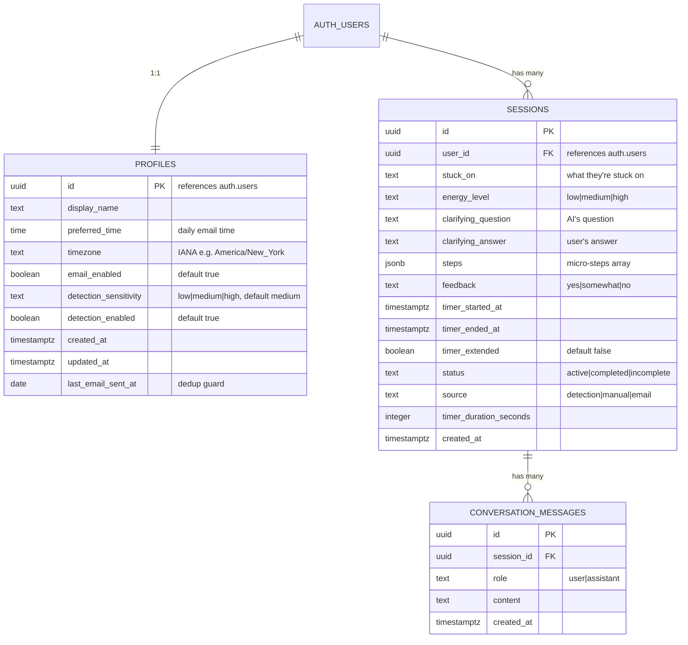

# feat: Build Unstuck Sensei as Tauri Desktop App

## Overview

Build Unstuck Sensei as a **Tauri v2 desktop app** instead of a pure web app. The desktop form factor enables the product's core differentiator: **passive detection of stuck/distracted states** via app-switch frequency and idle time monitoring — something a browser tab cannot do.

The app lives in the system tray, monitors work patterns locally (no content logging), and proactively nudges the user when it detects they might be stuck. The coaching session flow (6 steps, under 3 minutes) remains the same as the original plan. A thin hosted backend on Vercel handles Claude API proxying and daily email cron.

**Supersedes:** `docs/plans/2026-03-12-feat-unstuck-sensei-mvp-plan.md` (web-only approach)

**Source documents:**
- `C1_MVP_Scope_AI_Start_Coach.docx` — original product spec
- `docs/brainstorms/2026-03-12-unstuck-sensei-mvp-brainstorm.md` — refined brainstorm
- `docs/plans/2026-03-12-feat-unstuck-sensei-mvp-plan.md` — original web MVP plan (session flow, data model, prompts still apply)

## Problem Statement / Motivation

Solo founders know what they need to do but struggle to start. The original web MVP relies on the user **self-identifying** as stuck and proactively opening the app. This creates two problems:

1. **The stuck user doesn't seek help.** When you're deep in avoidance-scrolling or bouncing between tabs, you don't think "I should open my coaching app." The moment you'd benefit most from the tool is the moment you're least likely to use it.
2. **The daily email is a weak trigger.** It fires at a scheduled time, not when you're actually stuck. By the time you're stuck at 2pm, the 9am email is long forgotten.

A desktop app solves both by **detecting stuck behavior in real-time** and nudging proactively. This is the core differentiator over "just use ChatGPT."

## Proposed Solution

A Tauri v2 desktop app that:
- **Runs in the system tray**, always available, auto-launches on login
- **Monitors app-switch frequency and idle time** locally (Rust backend, no content logging)
- **Sends a native notification** when stuck/distracted behavior is detected
- **Opens a coaching session window** on click — same 6-step flow
- **Runs timers in Rust** — no browser throttling, 100% reliable
- **Connects to Supabase** for auth, session storage, and history
- **Calls Claude via a hosted Vercel proxy** — API key stays server-side

### What Changes vs. the Web MVP

| Aspect | Web MVP | Desktop MVP |
|---|---|---|
| Entry point | Browser bookmark or email link | System tray + proactive notification |
| Stuck detection | None (user self-selects) | Passive monitoring of app switches + idle time |
| Timer | Browser-based (throttled in background) | Rust-native (100% reliable) |
| Notifications | Browser notifications (unreliable) | Native OS notifications |
| Always running | No | Yes (tray app, auto-launch) |
| Frontend | Next.js with SSR | Vite + React in Tauri WebView |
| API routes | Next.js API routes on Vercel | Thin Vercel proxy (Claude only) + Supabase direct |
| Server Actions | Yes | No — direct Supabase client calls |
| Daily email | Primary retention lever | Secondary — detection is the primary trigger |
| Distribution | URL | Signed .dmg (macOS), signed .exe (Windows) |

### What Stays the Same

- **6-step coaching session flow** (identical UX)
- **Data model** (profiles, sessions, conversation_messages — same schema)
- **AI prompts** (same system prompt, same context injection)
- **Supabase** for auth + database + RLS
- **Claude Haiku 4.5** for coaching
- **Resend** for daily emails
- **Vercel** for hosting the proxy + cron

## Technical Approach

### Architecture

```
┌──────────────────────────────────────────────────────┐
│              Tauri v2 Desktop App                     │
│                                                      │
│  ┌──────────────┐  ┌───────────────────────────────┐ │
│  │  React UI    │  │  Rust Backend                  │ │
│  │  (WebView)   │  │                                │ │
│  │  Vite +      │  │  - System tray management      │ │
│  │  React +     │  │  - Stuck detection engine      │ │
│  │  Tailwind    │  │  - Timer (tokio)               │ │
│  │              │  │  - Native notifications        │ │
│  │              │  │  - Auto-launch                  │ │
│  │              │  │  - Auto-updater                 │ │
│  └──────┬───────┘  └──────────┬────────────────────┘ │
│         │  Tauri Commands     │                      │
│         ├─────────────────────┤                      │
│         │                     │                      │
└─────────┼─────────────────────┼──────────────────────┘
          │                     │
    ┌─────▼─────┐         ┌────▼──────┐
    │ Supabase  │         │  Vercel   │
    │ Auth + DB │         │  (Hosted) │
    │ (Postgres)│         │           │
    │ Direct    │         │  /api/chat│
    │ from      │         │  (Claude  │
    │ client    │         │   proxy)  │
    └───────────┘         │           │
                          │  /api/cron│
                          │  (email)  │
                          └───────────┘
```

**Key architectural decisions:**

- **Vite + React** frontend — no SSR needed, Vite is the default Tauri template, simpler than Next.js for a static client-side app. Uses `react-router` for routing.
- **Direct Supabase calls** from the browser client for all DB operations.
- **Vercel proxy** for Claude streaming only — keeps the Anthropic API key server-side. Authenticates via Supabase JWT forwarded from the desktop app. Rate-limited per user.
- **Rust backend** handles all native capabilities: tray, detection, timer, notifications, auto-launch, auto-update.
- **Tauri Commands** bridge Rust ↔ JS: the frontend invokes Rust functions and listens to Rust-emitted events.
- **Distribution:** Direct download from website. macOS: Developer ID signed + notarized `.dmg`. Windows: Code-signed `.exe`/`.msi`. **Not** Mac App Store (sandboxing would block monitoring).

### Stuck Detection Engine

The core differentiator. Runs entirely in Rust, entirely local, logs no content.

#### Available Signals

| Signal | macOS API | Windows API | Permission | Privacy Impact |
|---|---|---|---|---|
| **App switch count** | `NSWorkspace.didActivateApplicationNotification` | `GetForegroundWindow` polling | None | None — counts only, no app names logged |
| **System idle time** | IOKit `HIDIdleTime` | `GetLastInputInfo` | None | None |
| **Active app name** (optional) | `NSWorkspace` (app name from notification) | `GetForegroundWindow` + `GetWindowText` | None | Low — used for category classification, not logged |
| **App category** (optional) | Map bundle ID → category locally | Map process name → category locally | Accessibility (macOS) | Low — only the category is used, never the app name |

#### Detection Algorithm

```
// Runs every 5 minutes in a Rust background thread

struct DetectionWindow {
    app_switches: u32,        // count of foreground app changes
    idle_seconds_max: u32,    // longest idle period in window
    window_start: Instant,
}

fn evaluate(window: &DetectionWindow, sensitivity: Sensitivity) -> bool {
    let threshold = match sensitivity {
        Sensitivity::Low => 12,     // tolerant
        Sensitivity::Medium => 8,   // default
        Sensitivity::High => 5,     // aggressive
    };

    // High switching + not idle = bouncing between apps (stuck/distracted)
    // High switching + high idle = stepped away, not stuck
    window.app_switches >= threshold && window.idle_seconds_max < 120
}
```

#### False Positive Mitigation

**MVP (Phase 2):**

| Scenario | Mitigation |
|---|---|
| **In a meeting** (Zoom, Meet, Teams) | Detect known video call apps in foreground; suppress detection while active |
| **Just dismissed a notification** | 30-minute cooldown after dismissal. No cooldown after completing a session. |
| **User manually paused** | "Pause detection" option in tray menu. Auto-resumes after 2 hours or on next app launch. |

**Post-MVP (fast follow):**

| Scenario | Mitigation |
|---|---|
| **Full-screen app** (presenting, watching) | Suppress detection when any app is full-screen |
| **Multi-monitor users** | Count only *foreground* app changes, not window focus changes across monitors |
| **macOS Spaces switching** | Filter out Space-change events (they fire workspace notifications, not app-change) |
| **Legitimate research** (switching between docs + code) | The sensitivity setting lets users self-calibrate. Default (Medium) is intentionally tolerant. |

#### Calibration (Post-MVP)

For MVP, use fixed thresholds with user-adjustable sensitivity (Low/Medium/High). Post-MVP, add a 2-day silent calibration period that establishes a per-user baseline.

### Data Model

Identical to the web MVP plan with one addition:



**Changes from web MVP:**
- `profiles.detection_sensitivity` — user-adjustable (low/medium/high)
- `profiles.detection_enabled` — master toggle for passive monitoring
- `sessions.source` — now includes `detection` as a value (in addition to `manual` and `email`)

### Project Structure

```
src-tauri/                          # Rust backend
  src/
    main.rs                         # Tauri app setup, tray, plugins
    detection/
      mod.rs                        # Detection engine entry point
      monitor.rs                    # App-switch + idle time monitoring
      evaluator.rs                  # Stuck score calculation + thresholds
      suppression.rs                # Meeting/fullscreen/cooldown logic
    timer.rs                        # 25-min countdown (tokio-based)
    commands.rs                     # Tauri commands exposed to JS
  Cargo.toml
  tauri.conf.json                   # Tauri config (window, tray, permissions, updater)
  icons/                            # App icons for all platforms

src/                                # React frontend (Vite)
  App.tsx                           # Root component + react-router setup
  main.tsx                          # Entry point
  pages/
    Login.tsx                       # Sign-in / sign-up
    Session.tsx                     # Main session flow (6 steps)
    SessionDetail.tsx               # Past session detail (read-only)
    History.tsx                     # Session history list
    Settings.tsx                    # Email, detection, account settings
    Onboarding.tsx                  # Post-signup: time picker + privacy note
  hooks/
    useChat.ts                      # Client-side streaming from Vercel proxy
    useTimer.ts                     # Bridges Rust timer commands to React state
    useDetection.ts                 # Listens to Rust detection events
    useAuth.ts                      # Supabase auth state management
  components/
    session/
      StuckInput.tsx
      EnergySelector.tsx
      ClarifyingQuestion.tsx
      StepsList.tsx
      Timer.tsx
      CheckIn.tsx
    settings/
      DetectionSettings.tsx         # Sensitivity slider, enable/disable, pause
      PrivacyDashboard.tsx          # "Here's what we track" transparency screen
    ui/
      Button.tsx
      Input.tsx
      Card.tsx
    Layout.tsx                      # Authenticated layout with nav
  lib/
    supabase.ts                     # Browser Supabase client
    prompts/
      session.ts                    # System prompt + context builder
    database.types.ts               # Generated from Supabase schema

# Hosted on Vercel (separate or same repo)
vercel-api/
  api/
    chat/route.ts                   # Claude proxy — validates Supabase JWT, streams Claude response
    cron/daily-email/route.ts       # Vercel Cron: daily email sender (same as web MVP)
  vercel.json                       # Cron config for daily email

vite.config.ts
tailwind.config.ts
package.json
```

### Implementation Phases

---

#### Phase 1: Foundation — Tauri + Auth + Tray (Days 1–4)

Scaffolding, auth, database, tray app running. Goal: a signed-in user sees the app in their system tray and can open a window.

**Tasks:**

- [ ] Initialize Tauri v2 project with React + TypeScript frontend
  - `npm create tauri-app` with React + TypeScript template
  - Install `react-router` for client-side routing
  - Files: `src-tauri/`, `src/`, `package.json`, `tauri.conf.json`, `vite.config.ts`
- [ ] Set up Tailwind CSS in the frontend
- [ ] Initialize git repo, `.gitignore` (Node, Rust target, `.env*`, `.DS_Store`)
- [ ] Create `.env` and `.env.example`:
  ```
  VITE_SUPABASE_URL=
  VITE_SUPABASE_ANON_KEY=
  VITE_VERCEL_API_URL=   # URL of hosted proxy
  ```
- [ ] Create Supabase project, set up database schema (same tables as web MVP + detection fields on profiles)
  - Include `handle_new_user()` trigger for auto-creating profiles
  - RLS policies on all tables
- [ ] Install `@supabase/supabase-js` and create browser client `src/lib/supabase.ts`
  - No server client needed — all DB calls are client-side
  - Store refresh token in OS keychain via Tauri `tauri-plugin-store` (encrypted)
- [ ] Build auth page `src/pages/Login.tsx` — sign-in / sign-up (email + password)
  - Magic link support: opens system browser for callback, deep link back to app via custom URL scheme (`unstucksensei://auth/callback`)
- [ ] Register custom URL scheme in `tauri.conf.json` for deep links
- [ ] Set up system tray with `TrayIconBuilder`:
  - Tray icon with menu: "Start Session", "Pause Detection", "Settings", "Quit"
  - Click tray icon → opens main window
  - Window close → hides to tray (not quit)
- [ ] Configure auto-launch via `tauri-plugin-autostart` with `--minimized` flag
- [ ] Build authenticated layout `src/components/Layout.tsx` with nav (Session, History, Settings)
- [ ] Generate TypeScript types from Supabase schema
- [ ] Create `CLAUDE.md` documenting conventions, Tauri patterns, commands

**Success criteria:** App launches, sits in tray, user can sign up/in, tray menu works, window hides to tray on close, auto-launches on login.

---

#### Phase 2: Stuck Detection Engine (Days 4–7)

The core differentiator. Build the Rust-side monitoring and notification system.

**Tasks:**

- [ ] Implement app-switch monitoring in `src-tauri/src/detection/monitor.rs`
  - macOS: Subscribe to `NSWorkspace.didActivateApplicationNotification`
  - Windows: Poll `GetForegroundWindow` every 1 second
  - Count switches per 5-minute sliding window
  - Do NOT log app names — count only
- [ ] Implement idle time detection
  - macOS: Read `IOHIDSystem` → `HIDIdleTime` via IOKit
  - Windows: `GetLastInputInfo` → calculate seconds since last input
- [ ] Implement stuck score evaluation in `src-tauri/src/detection/evaluator.rs`
  - Three sensitivity levels: Low (12+ switches), Medium (8+), High (5+)
  - Require idle < 120s (distinguish "bouncing" from "away")
  - Emit `stuck-detected` event to frontend
- [ ] Implement false positive suppression in `src-tauri/src/detection/suppression.rs`
  - Detect known video call apps (Zoom, Google Meet, Microsoft Teams, Slack Huddle) — suppress while in foreground
  - 30-minute cooldown after notification dismissal
  - Manual pause from tray menu (auto-resumes after 2 hours)
  - Respect `detection_enabled` toggle
- [ ] Implement native notifications via `tauri-plugin-notification`
  - On stuck detected: "Seems like you're bouncing around. Want to break it down?"
  - On notification click → open session window, set source to `detection`
  - On dismiss → start cooldown
- [ ] Expose Tauri commands to JS:
  - `get_detection_status` → returns current state (monitoring, paused, suppressed)
  - `set_detection_sensitivity(level)` → updates threshold
  - `pause_detection(duration_minutes)` → temporary pause
  - `resume_detection()`
- [ ] Create `hooks/useDetection.ts` to listen to Rust detection events in React

**Success criteria:** App detects rapid app-switching in the background, sends a native notification, clicking it opens the session window. False positives suppressed during meetings and full-screen. Sensitivity adjustable.

---

#### Phase 3: Core Session Flow (Days 7–11)

Same 6-step coaching session as the web MVP, adapted for Tauri.

**Tasks:**

- [ ] Set up the hosted Vercel proxy `vercel-api/api/chat/route.ts`
  - Validate Supabase JWT from `Authorization` header
  - Extract `user_id` from JWT
  - Fetch last 3–5 sessions from Supabase (using service role)
  - Build system prompt with context injection (`src/lib/prompts/session.ts`)
  - Call Claude Haiku 4.5 via `@anthropic-ai/sdk` with streaming
  - Stream response back as ReadableStream
  - Rate limit: max 20 requests per user per hour
  - Error handling: auto-retry once on Claude failure, then return error
  - Cap `max_tokens` at 1024
- [ ] Deploy Vercel proxy, set environment variables (`ANTHROPIC_API_KEY`, `SUPABASE_SERVICE_ROLE_KEY`, `SUPABASE_URL`)
- [ ] Build session page `src/pages/Session.tsx` — stateful component managing 6 steps
- [ ] Implement Step 1: "What are you stuck on?" input (`src/components/session/StuckInput.tsx`)
  - Returning users: show context from last session
  - If source is `detection`: pre-fill with "I was bouncing between apps" as placeholder (editable)
- [ ] Implement Step 2: Energy selector (`src/components/session/EnergySelector.tsx`)
  - Three large buttons: Low / Medium / High
- [ ] Create `src/hooks/useChat.ts` — streaming hook that calls the Vercel proxy
  - Sends Supabase JWT in `Authorization` header
  - Manages streaming state, accumulated response, error state
- [ ] Implement Step 3: AI interaction (`src/components/session/ClarifyingQuestion.tsx`)
  - Stream AI response
  - If clarifying question → show answer input → second API call → steps
  - If direct steps → render them
  - Loading state: subtle pulsing indicator
- [ ] Parse AI response into structured steps, store as JSONB
- [ ] Implement Step 4: Steps confirmation (`src/components/session/StepsList.tsx`)
  - Display 3–5 micro-steps
  - Up/down arrow buttons for reorder
  - "Try again" button for re-decomposition
  - "Start working on [first step]" confirms and starts timer
- [ ] Save partial session data to Supabase at each step (active → completed progression)
- [ ] Store conversation messages in `conversation_messages` table
- [ ] Handle offline at Step 3: show friendly error "No internet connection. Try again when you're back online." with retry button

**Success criteria:** Full coaching session works end-to-end from detection notification through micro-steps. Data persisted to Supabase. Offline handled gracefully at AI step.

---

#### Phase 4: Rust Timer + Check-in (Days 11–14)

Reliable timer in Rust, notification on completion, check-in flow.

**Tasks:**

- [ ] Implement 25-minute timer in Rust (`src-tauri/src/timer.rs`)
  - Use `tokio::time::interval` or `Instant` comparison
  - Emit `timer-tick` events to frontend every second (current remaining time)
  - Emit `timer-complete` event when done
  - Expose commands: `start_timer`, `stop_timer`, `extend_timer`, `get_timer_state`
- [ ] Create `src/hooks/useTimer.ts` — bridges Rust timer to React state
  - Listens to `timer-tick` and `timer-complete` events
  - Exposes: `timeRemaining`, `isRunning`, `start()`, `stop()`, `extend()`
- [ ] Build timer UI (`src/components/session/Timer.tsx`)
  - Large countdown display (MM:SS)
  - First step text as reminder
  - Stop button
  - Show timer in tray icon tooltip
- [ ] Send native notification when timer completes
  - "Time's up! How did it go?"
  - Click → opens check-in
  - If user is AFK: notification persists in notification center, check-in shown when window opened
- [ ] Implement timer extension
  - On completion: "Want to keep going?" → Extend (+25 min) / Done
  - Max 1 extension (50 min cap)
  - Set `timer_extended = true` on session
- [ ] Implement Step 6: Check-in (`src/components/session/CheckIn.tsx`)
  - "Did you get started?" — Yes / Somewhat / No
  - Save feedback + timer duration + `completed` status to session
  - Positive message regardless of answer
- [ ] Handle mid-timer abandonment
  - Tauri `on_window_event` → if window closed during timer, save session as `incomplete`
  - On next session start: offer to resume or start fresh
- [ ] Suppress stuck detection while timer is running (user is working, not stuck)

**Success criteria:** Timer runs reliably even when window is hidden. Notification fires on completion. Check-in saves. Detection paused during timer. Abandoned sessions saved.

---

#### Phase 5: History + Settings + Privacy (Days 14–17)

User-facing session history, settings, and the critical privacy transparency screen.

**Tasks:**

- [ ] Build session history page `src/pages/History.tsx`
  - List: date, task (truncated), energy badge, feedback badge, source badge (detection/manual/email)
  - Most recent first
  - Empty state with CTA
- [ ] Build session detail view `src/pages/SessionDetail.tsx`
  - Read-only: stuck_on, energy, clarifying Q&A, steps, feedback, timer duration, source
  - Back to history
- [ ] Build settings page `src/pages/Settings.tsx`
  - **Detection section:** enable/disable toggle, sensitivity slider (Low/Medium/High)
  - **Email section:** daily email toggle, time picker
  - **Account section:** display name, password change
  - All updates via direct Supabase client calls
- [ ] Build Privacy Dashboard (`src/components/settings/PrivacyDashboard.tsx`)
  - "Here's exactly what Unstuck Sensei tracks"
  - What's tracked locally: app switch count (no app names), idle time
  - What's sent to server: session text, AI responses, feedback, timestamps
  - What's never collected: app names, URLs, keystrokes, screenshots
  - Link to delete account and all data
  - Shown during onboarding AND accessible from settings
- [ ] Build onboarding flow `src/pages/Onboarding.tsx`
  - Step 1: "When do you usually start work?" (time picker for daily email)
  - Step 2: Brief privacy note — "Unstuck Sensei counts app switches to detect when you're stuck. No app names, URLs, or keystrokes are ever recorded." Link to full Privacy Dashboard in settings.
  - Detection defaults to Medium sensitivity. Straight to first session after onboarding.

**Success criteria:** Users can browse past sessions, manage all settings, and clearly understand what the app tracks. Onboarding is fast (2 steps) and leads straight to first session.

---

#### Phase 6: Daily Email + Deep Links (Days 17–19)

Secondary retention mechanism. Same as web MVP, adapted for desktop deep links.

**Tasks:**

- [ ] Set up Resend: account, verify domain (SPF, DKIM, DMARC)
- [ ] Build cron endpoint `vercel-api/api/cron/daily-email/route.ts`
  - Same logic as web MVP: timezone-aware, dedup via `last_email_sent_at`, context-aware content
  - CTA link: `unstucksensei://start-session?source=email`
  - Fallback for users without app installed: `https://unstucksensei.com/download` with message
- [ ] Configure Vercel Cron in `vercel.json`: `*/15 * * * *`
- [ ] Handle deep link `unstucksensei://start-session` in Tauri
  - If app running: bring window to front, start session with `source: email`
  - If app not running: OS launches app, then handle the deep link on init
- [ ] Email footer: "Don't want these? Open Settings in Unstuck Sensei to adjust."
- [ ] Handle edge case: email opened on phone → show "Open this on your computer" page

**Success criteria:** Daily emails send at correct times. Deep link opens the app and starts a session. Works when app is running and when it needs to be launched.

---

#### Phase 7: Distribution + Polish (Days 19–22)

Code signing, auto-updater, landing/download page, responsive session UI.

**Tasks:**

- [ ] Set up macOS code signing
  - Apple Developer account ($99/year)
  - Developer ID Application certificate
  - Notarization via `xcrun notarytool`
  - Configure in `tauri.conf.json`
- [ ] Set up Windows code signing
  - Code signing certificate (EV recommended to avoid SmartScreen warnings)
  - Configure in `tauri.conf.json`
- [ ] Set up auto-updater via `tauri-plugin-updater`
  - Host update manifests on GitHub Releases
  - Check for updates on app launch + every 6 hours
  - Prompt user to update (not silent)
- [ ] Set up CI/CD with GitHub Actions
  - Matrix build: macOS runner → `.dmg`, Windows runner → `.exe`/`.msi`
  - Auto-upload to GitHub Releases on tag push
  - Include update manifest JSON in release
- [ ] Build download/landing page (static page on Vercel)
  - Detect OS → show correct download button
  - Brief product explanation
  - Privacy-first messaging
- [ ] Polish session flow UI
  - Test on both WKWebView (macOS) and WebView2 (Windows)
  - Ensure energy selector has large touch targets
  - Timer display: large, readable
- [ ] Add tray icon states:
  - Default: monitoring
  - Pulsing/colored: stuck detected
  - Clock: timer running
  - Paused: detection paused
- [ ] Error boundary for session flow
- [ ] Production deployment checklist:
  - All env vars set on Vercel (proxy + cron)
  - Supabase project configured (auth redirect URLs, RLS tested)
  - Resend domain verified
  - Code signing working on both platforms
  - Auto-updater tested end-to-end

**Success criteria:** Signed, notarized app distributed via direct download. Auto-updates working. Landing page live. Works on macOS and Windows.

---

## Acceptance Criteria

### Functional Requirements

- [ ] App launches to system tray, auto-starts on login
- [ ] User can sign up/in with email + password
- [ ] Stuck detection monitors app-switch frequency and idle time in background
- [ ] Native notification fires when stuck behavior detected (configurable sensitivity)
- [ ] Detection suppressed during meetings, full-screen, and 30-min post-dismissal cooldown
- [ ] User can start a session manually from tray menu
- [ ] Full 6-step coaching session works (stuck input → energy → AI steps → confirm → timer → check-in)
- [ ] AI generates 3–5 energy-appropriate micro-steps via Claude Haiku 4.5 (streamed via Vercel proxy)
- [ ] 25-minute Rust-native timer works reliably (even when window hidden)
- [ ] Native notification on timer completion
- [ ] Timer extendable once (+25 min, 50 min cap)
- [ ] Check-in feedback saved to Supabase
- [ ] Partial sessions saved at each step
- [ ] Session history shows all past sessions with source (detection/manual/email)
- [ ] Daily email sends at user's chosen time, deep link opens app
- [ ] User can adjust detection sensitivity, disable detection, and manage email prefs in settings
- [ ] Privacy dashboard clearly shows what is and isn't tracked

### Non-Functional Requirements

- [ ] Detection runs with zero content logging (no app names, URLs, keystrokes)
- [ ] Claude API key never in desktop app — only on Vercel proxy
- [ ] Supabase JWT used to authenticate proxy requests, rate-limited per user
- [ ] All user data protected by Supabase RLS
- [ ] App signed and notarized (macOS) / code-signed (Windows)
- [ ] Auto-updater with signed update manifests
- [ ] Session flow completes in under 3 minutes
- [ ] AI response streams within 2–3 seconds
- [ ] Rust timer accurate to ±1 second

### Quality Gates

- [ ] Detection tested: correct threshold behavior, suppression during meetings, cooldown after dismissal
- [ ] Timer tested: accuracy across window states (visible, hidden, tray-only)
- [ ] Auth tested: sign up, sign in, token refresh, session expiry
- [ ] Proxy tested: JWT validation, rate limiting, Claude error handling
- [ ] RLS tested: user can only access own data
- [ ] Both platforms tested: macOS (WKWebView) and Windows (WebView2)
- [ ] Deep link tested: email → app open → session start

## Analytics & Metrics

Instrument with PostHog (or Plausible) to measure detection accuracy and product-market fit.

**Detection metrics (critical for tuning):**
- Detection trigger rate (per user per day)
- Notification dismissal rate vs. session-start rate
- Detection → session conversion rate
- Time between detection trigger and session start

**Product metrics (same as web MVP):**
- Session completion rate (started → check-in done)
- Source breakdown: detection vs. manual vs. email
- "Did you get started?" yes rate (target: 60%+)
- Return rate: 2+ sessions (target: 30%+)
- Email open rate and email → session conversion

**Implementation:** Add PostHog JS SDK to the Vite frontend. Track events at key moments: `detection_triggered`, `detection_dismissed`, `session_started` (with source), `session_completed`, `timer_started`, `timer_extended`, `checkin_submitted`.

## Risk Analysis & Mitigation

| Risk | Likelihood | Impact | Mitigation |
|---|---|---|---|
| Rust learning curve slows development | High | Medium | Keep Rust code minimal — use Tauri plugins where possible. Detection + timer are the only custom Rust. |
| Detection thresholds produce too many false positives | High | High | Ship with detection defaulting to Medium sensitivity. Include "Pause for 2 hours" in every notification. Collect dismissal rate as a metric to tune. |
| macOS code signing / notarization issues | Medium | High | Budget time in Phase 7 for signing issues. Apple Developer account enrollment can take 24-48 hours — start early. |
| Users don't grant trust to a monitoring app | Medium | High | Privacy Dashboard in onboarding. No content logging. Local-only detection. "Here's exactly what we track." |
| WebView rendering differences (WKWebView vs WebView2) | Medium | Low | Test CSS on both platforms in Phase 3. Keep UI simple. |
| Deep links unreliable across OS versions | Medium | Medium | Daily email is secondary to detection. If deep links fail, email just says "Open Unstuck Sensei." |
| Auto-update signing complexity | Low | Medium | Use GitHub Releases + Tauri updater plugin (well-documented path). |
| Claude API downtime | Low | High | Auto-retry once. Friendly error with manual retry. No fallback model for MVP. |

## Dependencies & Prerequisites

| Dependency | Setup Required | Blocking Phase |
|---|---|---|
| Tauri v2 CLI + Rust toolchain | Install Rust, Tauri CLI | Phase 1 |
| Supabase project | Create project, get API keys | Phase 1 |
| Apple Developer account | Enroll ($99/year), create certificates | Phase 1 (test early) |
| Vercel account | Connect proxy repo | Phase 3 |
| Anthropic API key | Create account, get API key | Phase 3 |
| Windows code signing cert | Purchase certificate | Phase 7 |
| Resend account | Create account, verify domain | Phase 6 |

## What's NOT in MVP

Everything from the web MVP "not in MVP" list, plus:
- Per-user baseline calibration for detection (post-MVP)
- App category classification with Accessibility permission (post-MVP — zero-permission signals first)
- Browser URL classification (not planned)
- Keystroke pattern analysis (not planned — too invasive)
- Linux support (post-MVP)
- Mac App Store distribution (incompatible with monitoring — see Risk Analysis)
- Mobile companion app (Tier 3)
- Voice interface — post-MVP, introduce voice input/output where feasible (e.g., voice-dictate "what are you stuck on" instead of typing, spoken micro-steps while user stays in their editor). Natural fit for a desktop app that's already running in the background.

## Prompt Architecture

Identical to the web MVP plan. See `docs/plans/2026-03-12-feat-unstuck-sensei-mvp-plan.md` → "Prompt Architecture" section.

Only addition: when `source = detection`, prepend to the user context:
```
The user was nudged by Unstuck Sensei after detecting they might be stuck
(high app-switching). They may not have a specific task in mind yet — help
them identify what they were trying to do.
```

## Key Technical Patterns

### Tauri Command Pattern (Rust ↔ JS)

```rust
// src-tauri/src/commands.rs
#[tauri::command]
fn start_timer(duration_seconds: u64, app: tauri::AppHandle) -> Result<(), String> {
    // Spawn tokio task for timer
    // Emit events to frontend
}

#[tauri::command]
fn get_detection_status(state: tauri::State<DetectionState>) -> DetectionStatus {
    // Return current monitoring state
}
```

```typescript
// Frontend: src/hooks/useTimer.ts
import { invoke } from '@tauri-apps/api/core';
import { listen } from '@tauri-apps/api/event';

await invoke('start_timer', { durationSeconds: 1500 });
const unlisten = await listen('timer-tick', (event) => {
  setTimeRemaining(event.payload as number);
});
```

### Vercel Proxy Authentication

```typescript
// vercel-api/api/chat/route.ts
import { createClient } from '@supabase/supabase-js';

export async function POST(req: Request) {
  const jwt = req.headers.get('Authorization')?.replace('Bearer ', '');
  if (!jwt) return new Response('Unauthorized', { status: 401 });

  const supabase = createClient(SUPABASE_URL, SUPABASE_SERVICE_ROLE_KEY);
  const { data: { user }, error } = await supabase.auth.getUser(jwt);
  if (error || !user) return new Response('Unauthorized', { status: 401 });

  // Rate limit check per user.id
  // Forward to Claude API with streaming
}
```

## References

### Research
- Tauri v2 tray, plugins, updater, background throttling — see research notes
- Stuck detection signals: app-switch frequency is strongest software-only signal (Muller & Fritz, 2015)
- Privacy: local-only detection with zero content logging avoids the "creepy monitoring" perception

### Key Docs
- [Tauri v2 docs](https://v2.tauri.app/)
- [`user-idle` crate](https://crates.io/crates/user-idle) — cross-platform idle time
- [`active-win-pos-rs` crate](https://crates.io/crates/active-win-pos-rs) — active window detection
- [Tauri + Vite guide](https://v2.tauri.app/start/frontend/vite/)
- [Tauri updater plugin](https://v2.tauri.app/plugin/updater/)
- [Tauri autostart plugin](https://v2.tauri.app/plugin/autostart/)
- [Tauri notification plugin](https://v2.tauri.app/plugin/notification/)
