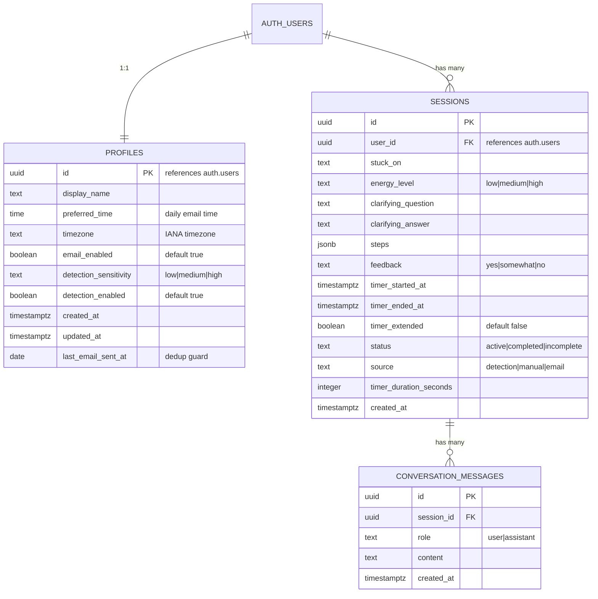

# feat: Build Unstuck Sensei Tauri Desktop MVP

## Overview

Build Unstuck Sensei as a Tauri v2 desktop app that helps solo founders notice when they are stuck, break work into a first move, and start quickly.

The MVP lives in the system tray, monitors high-level work patterns locally, nudges the user with native notifications when they look stuck, and opens a short AI coaching session that ends in a reliable 25-minute work timer. A thin hosted backend handles Claude proxying and the daily email cron.

**Source documents:**
- `C1_MVP_Scope_AI_Start_Coach.docx` - original product spec
- `docs/brainstorms/2026-03-12-unstuck-sensei-mvp-brainstorm.md` - refined brainstorm with product decisions

## Problem Statement / Motivation

Solo founders often know what they should do next but still fail to start. The hard moment is not planning. It is the moment they begin bouncing between apps, avoid the real task, or drift into low-signal work.

The MVP needs to test two hypotheses:
1. A short, structured AI coaching session can help founders start work on a stuck task faster.
2. A desktop app that is present at the moment of friction can trigger more sessions than a tool the user must remember to open manually.

The desktop form factor matters because it can:
- stay available in the tray
- detect likely stuck behavior from app switching and idle time
- send native notifications at the moment the user is drifting
- run a timer reliably even when the window is hidden

## Proposed Solution

A Tauri v2 desktop app that:
- runs in the system tray and can auto-launch on login
- monitors app-switch frequency and idle time locally, without content logging
- sends a native notification when it detects likely stuck behavior
- opens a 6-step coaching session when the user starts a session from a notification, tray menu, or email deep link
- stores auth, sessions, history, and settings in Supabase
- calls Claude through a hosted Vercel proxy so the Anthropic API key stays server-side
- sends a daily email as a secondary retention mechanism

### Core Product Experience

1. User gets nudged or manually starts a session.
2. User says what they are stuck on.
3. User selects their current energy level.
4. AI asks at most one clarifying question, then returns 3-5 concrete micro-steps.
5. User confirms the step list and starts a 25-minute timer.
6. User checks in with `yes`, `somewhat`, or `no`.

### Privacy Boundary

Tracked locally:
- app switch count
- idle time
- current detection state such as paused, active, or in cooldown

Sent to the server:
- session text entered by the user
- AI responses
- feedback
- timestamps and session metadata

Never collected in MVP:
- app names
- URLs
- keystrokes
- screenshots
- clipboard contents

## Technical Approach

### Architecture

```
┌──────────────────────────────────────────────────────┐
│              Tauri v2 Desktop App                   │
│                                                     │
│  ┌──────────────┐  ┌──────────────────────────────┐ │
│  │  React UI    │  │  Rust Backend                │ │
│  │  (WebView)   │  │                              │ │
│  │  Vite +      │  │  - System tray management    │ │
│  │  React +     │  │  - Stuck detection engine    │ │
│  │  Tailwind    │  │  - Timer                     │ │
│  │              │  │  - Native notifications      │ │
│  │              │  │  - Auto-launch               │ │
│  │              │  │  - Auto-updater              │ │
│  └──────┬───────┘  └──────────┬───────────────────┘ │
│         │  Tauri Commands     │                     │
│         ├─────────────────────┤                     │
└─────────┼─────────────────────┼─────────────────────┘
          │                     │
    ┌─────▼─────┐         ┌─────▼──────┐
    │ Supabase  │         │   Vercel   │
    │ Auth + DB │         │   Hosted   │
    │ Postgres  │         │            │
    │ direct    │         │ /api/chat  │
    │ from app  │         │ Claude     │
    └───────────┘         │ proxy      │
                          │            │
                          │ /api/cron  │
                          │ daily mail │
                          └────────────┘
```

### Key Architectural Decisions

- Frontend uses `Vite + React` with client-side routing. No SSR is needed.
- Supabase handles auth, database, and row-level security.
- The desktop app talks directly to Supabase for normal data operations.
- A hosted Vercel endpoint proxies Claude requests so the model key never ships in the desktop app.
- Rust owns native capabilities: tray behavior, detection, notifications, timer, auto-launch, updater.
- Tauri commands and events bridge Rust and the React UI.
- Distribution is direct download. macOS uses a signed and notarized `.dmg`. Windows uses a code-signed installer. Mac App Store distribution is out of scope because the sandbox is incompatible with background monitoring.

### Stuck Detection Engine

The detection engine is the differentiator. It runs entirely in Rust and processes only high-level signals.

#### Available Signals

| Signal | macOS API | Windows API | Permission | Privacy Impact |
|---|---|---|---|---|
| App switch count | `NSWorkspace.didActivateApplicationNotification` | `GetForegroundWindow` polling | None | None |
| System idle time | IOKit `HIDIdleTime` | `GetLastInputInfo` | None | None |
| Foreground app name for meeting suppression | `NSWorkspace` | foreground window inspection | None | Low, used only in memory for suppression |

#### Detection Algorithm

```rust
struct DetectionWindow {
    app_switches: u32,
    idle_seconds_max: u32,
}

fn evaluate(window: &DetectionWindow, sensitivity: Sensitivity) -> bool {
    let switch_threshold = match sensitivity {
        Sensitivity::Low => 12,
        Sensitivity::Medium => 8,
        Sensitivity::High => 5,
    };

    window.app_switches >= switch_threshold && window.idle_seconds_max < 120
}
```

Interpretation:
- high switching + low idle suggests bouncing between apps
- high switching + high idle suggests the user stepped away, not that they are stuck

#### False Positive Mitigation

MVP:
- suppress detection while known meeting apps are in the foreground
- start a 30-minute cooldown after the user dismisses a notification
- allow manual pause from the tray, auto-resume after 2 hours
- suppress detection while the work timer is running

Post-MVP:
- suppress during full-screen presentation states
- add a calibration period to learn user-specific baselines

### Data Model



### Schema Notes

- `profiles` is created automatically from `auth.users` via a trigger.
- `steps` is stored as JSONB for MVP simplicity.
- `last_email_sent_at` prevents duplicate daily sends.
- `sessions.source` tracks whether a session started from a detection notification, tray/manual start, or email deep link.
- `status` distinguishes completed work from abandoned sessions.

### Project Structure

```
src-tauri/
  src/
    main.rs
    commands.rs
    timer.rs
    detection/
      mod.rs
      monitor.rs
      evaluator.rs
      suppression.rs
  tauri.conf.json
  Cargo.toml
  icons/

src/
  App.tsx
  main.tsx
  pages/
    Login.tsx
    Session.tsx
    SessionDetail.tsx
    History.tsx
    Settings.tsx
    Onboarding.tsx
  hooks/
    useAuth.ts
    useChat.ts
    useDetection.ts
    useTimer.ts
  components/
    session/
      StuckInput.tsx
      EnergySelector.tsx
      ClarifyingQuestion.tsx
      StepsList.tsx
      Timer.tsx
      CheckIn.tsx
    settings/
      DetectionSettings.tsx
      PrivacyDashboard.tsx
    ui/
      Button.tsx
      Input.tsx
      Card.tsx
    Layout.tsx
  lib/
    supabase.ts
    prompts/
      session.ts
    database.types.ts

vercel-api/
  api/
    chat/route.ts
    cron/daily-email/route.ts
  vercel.json

vite.config.ts
tailwind.config.ts
package.json
```

## Implementation Phases

#### Phase 1: Foundation - Tauri, Auth, Tray (Days 1-4)

Goal: the app launches, sits in the tray, the user can sign up and sign in, and the main window can be opened from the tray.

**Tasks:**

- [x] Initialize a Tauri v2 project with React + TypeScript frontend
- [x] Set up Tailwind CSS and client-side routing
- [x] Create `.env` and `.env.example`
  ```bash
  VITE_SUPABASE_URL=
  VITE_SUPABASE_PUBLISHABLE_KEY=
  VITE_VERCEL_API_URL=
  ```
- [x] Create the Supabase project and schema
  - `profiles`
  - `sessions`
  - `conversation_messages`
  - row-level security policies
  - profile auto-creation trigger
- [x] Install `@supabase/supabase-js` and create `src/lib/supabase.ts`
- [x] Persist auth securely; do not store refresh tokens in plaintext app files
- [x] Build `src/pages/Login.tsx` for email/password sign-up and sign-in
- [ ] Register desktop deep links for future email entry points
- [x] Set up the tray icon and tray menu
  - Start Session
  - Pause Detection
  - Settings
  - Quit
- [x] Hide the window to tray on close instead of quitting
- [x] Configure auto-launch on login
- [x] Build `src/components/Layout.tsx`
- [x] Generate TypeScript types from the Supabase schema
- [x] Create `CLAUDE.md` with project conventions

**Success criteria:** The user can sign up, sign in, open the app from the tray, and keep it running in the tray after closing the window.

#### Phase 2: Stuck Detection Engine (Days 4-7)

Goal: the app detects likely stuck behavior in the background and nudges the user with a notification.

**Tasks:**

- [ ] Implement app-switch monitoring in `src-tauri/src/detection/monitor.rs`
  - macOS via workspace app activation notifications
  - Windows via foreground-window polling
- [ ] Implement idle time detection
- [ ] Implement the stuck evaluation logic in `src-tauri/src/detection/evaluator.rs`
  - Low sensitivity: 12+ switches in window
  - Medium sensitivity: 8+
  - High sensitivity: 5+
  - Require idle under 120 seconds
- [ ] Implement suppression logic in `src-tauri/src/detection/suppression.rs`
  - meeting app suppression
  - dismissal cooldown
  - manual pause
  - disable toggle
- [ ] Send native notifications
  - notification click opens a session
  - dismissal starts cooldown
- [ ] Expose Tauri commands
  - `get_detection_status`
  - `set_detection_sensitivity`
  - `pause_detection`
  - `resume_detection`
- [ ] Create `src/hooks/useDetection.ts` in the frontend

**Success criteria:** Rapid app switching triggers a native notification, clicking it opens the app, and suppression works for meetings, manual pause, and dismissal cooldown.

#### Phase 3: Core Session Flow (Days 7-11)

Goal: a user can complete the coaching flow from stuck input to step confirmation.

**Tasks:**

- [ ] Build the hosted Claude proxy in `vercel-api/api/chat/route.ts`
  - validate Supabase JWT from `Authorization`
  - load recent sessions for context
  - call Claude with streaming
  - rate limit per user
  - retry once on transient failure
- [ ] Deploy the proxy with environment variables
  - `ANTHROPIC_API_KEY`
  - `SUPABASE_SERVICE_ROLE_KEY`
  - `SUPABASE_URL`
- [ ] Build `src/pages/Session.tsx`
- [ ] Implement `src/components/session/StuckInput.tsx`
  - show a short reminder from recent sessions for returning users
  - when launched from detection, prefill a hint such as "I was bouncing between apps"
- [ ] Implement `src/components/session/EnergySelector.tsx`
- [ ] Create `src/hooks/useChat.ts`
  - send Supabase JWT to the proxy
  - manage streaming state and errors
- [ ] Implement `src/components/session/ClarifyingQuestion.tsx`
  - allow at most one clarifying round-trip
  - render direct steps when no clarification is needed
- [ ] Parse the AI response into structured steps and store them as JSONB
- [ ] Implement `src/components/session/StepsList.tsx`
  - display 3-5 micro-steps
  - allow reorder with up/down controls
  - support "Try again"
  - confirm with "Start working on [first step]"
- [ ] Save partial session state at each step
- [ ] Store assistant and user messages in `conversation_messages`
- [ ] Handle offline failures with a clear retry path

**Success criteria:** A full coaching session works from start to step confirmation, AI responses stream correctly, and session data persists after every stage.

#### Phase 4: Rust Timer and Check-in (Days 11-14)

Goal: the timer keeps running even when the window is hidden, and the user can complete a full session end-to-end.

**Tasks:**

- [ ] Implement the timer in `src-tauri/src/timer.rs`
  - emit `timer-tick`
  - emit `timer-complete`
  - expose `start_timer`, `stop_timer`, `extend_timer`, `get_timer_state`
- [ ] Create `src/hooks/useTimer.ts`
- [ ] Build `src/components/session/Timer.tsx`
  - large countdown
  - current first step reminder
  - stop button
- [ ] Show native notification on timer completion
- [ ] Implement a single timer extension of +25 minutes
- [ ] Implement `src/components/session/CheckIn.tsx`
  - `yes`
  - `somewhat`
  - `no`
- [ ] Save timer duration, extension state, feedback, and `completed` status
- [ ] Save `incomplete` when the user abandons the session mid-timer
- [ ] Suppress stuck detection while the timer is running

**Success criteria:** The timer is reliable, completion notifications fire, check-ins save correctly, and abandoned sessions are preserved.

#### Phase 5: History, Settings, Privacy (Days 14-17)

Goal: the user can review past sessions, manage settings, and clearly understand what the app tracks.

**Tasks:**

- [ ] Build `src/pages/History.tsx`
  - date
  - task summary
  - energy badge
  - feedback badge
  - source badge
- [ ] Build `src/pages/SessionDetail.tsx`
- [ ] Build `src/pages/Settings.tsx`
  - detection toggle
  - sensitivity setting
  - email toggle
  - daily email time
  - display name
  - password change
- [ ] Build `src/components/settings/PrivacyDashboard.tsx`
  - what is tracked locally
  - what is sent to the server
  - what is never collected
  - delete-account entry point
- [ ] Build `src/pages/Onboarding.tsx`
  - preferred work time
  - privacy note
  - default detection sensitivity

**Success criteria:** Users can browse session history, change settings, and understand the app's privacy model without ambiguity.

#### Phase 6: Daily Email and Deep Links (Days 17-19)

Goal: add a secondary retention loop that can open the desktop app directly into a session.

**Tasks:**

- [ ] Set up Resend and verify the sending domain
- [ ] Build `vercel-api/api/cron/daily-email/route.ts`
  - timezone-aware sending
  - dedup via `last_email_sent_at`
  - content adapts based on whether the user already completed a session that day
- [ ] Configure Vercel Cron to run every 15 minutes
- [ ] Add deep link handling for `unstucksensei://start-session?source=email`
  - if app is running, bring it forward
  - if app is not running, launch and route into a session
- [ ] Add a fallback for machines without the app installed
- [ ] Handle phone-opened email with a simple "open this on your computer" landing state

**Success criteria:** Daily emails send at the right local time and can open the app directly into a new session.

#### Phase 7: Distribution and Polish (Days 19-22)

Goal: ship a signed desktop app that can be installed and updated safely.

**Tasks:**

- [ ] Set up macOS code signing and notarization
- [ ] Set up Windows code signing
- [ ] Configure the Tauri auto-updater
- [ ] Set up CI/CD with GitHub Actions for macOS and Windows builds
- [ ] Publish installers and update manifests
- [ ] Build a landing/download page
- [ ] Polish the session flow UI on both WKWebView and WebView2
- [ ] Add tray icon states for monitoring, paused, detection prompt, and running timer
- [ ] Add an error boundary for the session flow
- [ ] Run a production deployment checklist for Supabase, Vercel, Resend, signing, and updater configuration

**Success criteria:** Signed installers are available, auto-updates work, and the product runs correctly on both target platforms.

## Acceptance Criteria

### Functional Requirements

- [ ] App launches to the system tray and can auto-start on login
- [ ] User can sign up and sign in with email + password
- [ ] Detection monitors app-switch frequency and idle time in the background
- [ ] Native notifications fire when likely stuck behavior is detected
- [ ] Detection respects sensitivity, disable state, meeting suppression, manual pause, and dismissal cooldown
- [ ] User can start a session manually from the tray menu
- [ ] Full 6-step coaching session works end-to-end
- [ ] AI produces 3-5 energy-appropriate micro-steps with streaming responses
- [ ] AI asks at most one clarifying question before decomposition
- [ ] Timer runs reliably even when the window is hidden
- [ ] Timer can be extended once
- [ ] Timer completion triggers a native notification
- [ ] Partial sessions save at each step
- [ ] Incomplete sessions are preserved
- [ ] Session history shows prior sessions with source badges
- [ ] Daily email sends at the chosen time and can open the app through a deep link
- [ ] Users can manage detection, email preferences, and privacy settings from the app

### Non-Functional Requirements

- [ ] Detection performs zero content logging
- [ ] Anthropic API key never ships in the desktop app
- [ ] All user data is protected by Supabase row-level security
- [ ] Session flow can be completed in under 3 minutes
- [ ] AI responses begin streaming within 2-3 seconds
- [ ] Timer accuracy stays within about +/-1 second over a standard session
- [ ] User-facing copy stays warm, direct, and free of productivity jargon

### Quality Gates

- [ ] Detection tested across threshold and cooldown behavior
- [ ] Timer tested while window is visible, hidden, and tray-only
- [ ] Auth tested across sign-up, sign-in, persistence, and expiry
- [ ] Proxy tested for JWT validation, rate limiting, and Claude failures
- [ ] Row-level security tested so users can access only their own data
- [ ] Deep links tested when the app is already running and when it must be launched
- [ ] UI tested on macOS and Windows

## Analytics and Metrics

Track with PostHog or Plausible.

Detection metrics:
- detection trigger rate per user per day
- dismissal rate vs session-start rate
- detection-to-session conversion rate
- time from detection to session start

Product metrics:
- session completion rate
- source mix: detection vs manual vs email
- "Did you get started?" yes rate, target `60%+`
- return rate for 2+ sessions, target `30%+`
- email open rate
- email-to-session conversion

Implementation events:
- `detection_triggered`
- `detection_dismissed`
- `session_started`
- `session_completed`
- `timer_started`
- `timer_extended`
- `checkin_submitted`

## Kill Criteria

After 6 weeks with 200+ signups: if return rate is below `15%` and "Did you get started?" yes rate is below `40%`, the core hypothesis is invalidated and the product direction needs to change.

## Risk Analysis and Mitigation

| Risk | Likelihood | Impact | Mitigation |
|---|---|---|---|
| Detection thresholds create too many false positives | High | High | Start with fixed thresholds, default to Medium, include pause and dismissal cooldown, tune from metrics |
| Users distrust a monitoring app | Medium | High | Keep detection local, avoid content logging, show the privacy dashboard during onboarding |
| macOS signing and notarization slows release | Medium | High | Start signing setup early and leave dedicated Phase 7 time |
| WebView differences cause UI regressions | Medium | Low | Test on both target platforms before release |
| Deep links fail on some OS setups | Medium | Medium | Keep tray/manual start as first-class entry points |
| Claude downtime blocks session creation | Low | High | Retry once, then show a friendly retry state |

## Dependencies and Prerequisites

| Dependency | Setup Required | Blocking Phase |
|---|---|---|
| Tauri v2 CLI + Rust toolchain | Install Rust and Tauri prerequisites | Phase 1 |
| Supabase project | Create project and keys | Phase 1 |
| Apple Developer account | Enroll and create signing assets | Phase 1 |
| Vercel account | Deploy proxy and cron | Phase 3 |
| Anthropic API key | Create account and key | Phase 3 |
| Resend account | Create account and verify domain | Phase 6 |
| Windows code-signing certificate | Purchase and configure | Phase 7 |

## Prompt Architecture

### System Prompt

Store in `src/lib/prompts/session.ts`.

```text
You are Unstuck Sensei, a warm and supportive peer coach for solo founders.

Your tone: casual, encouraging, like a supportive friend. Use "we" and "let's" language.
Never use productivity jargon (no "deep work", "time blocking", "eat the frog").
Never shame or guilt. Every session starts fresh.

Your job in this session:
1. If the user's input is vague, ask ONE clarifying question (max one).
2. Then decompose their task into 3-5 concrete micro-steps.
3. Sequence steps based on their energy level: {energy_level}.
   - Low energy: start with the easiest, most mechanical step
   - Medium energy: balanced sequence
   - High energy: start with the hardest or most impactful step

Output the steps as a numbered list. Each step should be specific enough to start
immediately and completable in 5-15 minutes.

Keep all responses under 150 words. Founders are impatient. Get to the steps fast.
```

### Per-Session Context Injection

Inject the last 3-5 sessions as structured text:

```text
Recent sessions for context:
- 2026-03-11: Stuck on "writing the pricing page" (energy: low). Feedback: yes
- 2026-03-10: Stuck on "deciding on a marketing channel" (energy: medium). Feedback: somewhat
- 2026-03-08: Stuck on "writing the pricing page" (energy: high). Feedback: yes
```

When the source is `detection`, prepend:

```text
The user was nudged by Unstuck Sensei after detecting they might be stuck
(high app-switching). They may not have a specific task in mind yet. Help
them identify what they were trying to do.
```

## What's Not in MVP

- Per-user baseline calibration for detection
- Full-screen suppression
- Browser URL classification
- Keystroke pattern analysis
- Google Calendar integration
- Personalized session openers based on behavior patterns
- Weekly momentum email
- Paywall and Stripe billing
- Community features
- Slack bot
- Notion or Todoist import
- Linux support
- Native mobile app
- Voice interface
- Mac App Store distribution

## References

### Product Inputs
- `docs/brainstorms/2026-03-12-unstuck-sensei-mvp-brainstorm.md`
- `C1_MVP_Scope_AI_Start_Coach.docx`

### Key Documentation
- Tauri v2 docs
- Supabase desktop auth and database docs
- Anthropic SDK streaming docs
- Resend sending and domain verification docs
- Vercel Cron configuration docs
