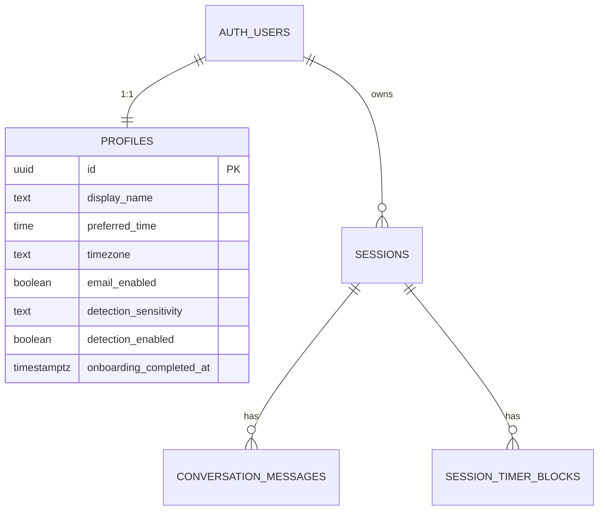

# feat: Phase 5 History, Settings, and Privacy

## Overview

Implement the Phase 5 slice of the desktop MVP: replace the placeholder `History` and `Settings` routes with real product screens, add a first-run onboarding gate, and make the app's privacy boundary explicit before Phase 6 daily email work begins.

This plan is grounded in the current repo state, not just the parent MVP checklist. The shell, auth, session flow, timer, profile schema, and timer block persistence already exist. Phase 5 should build directly on those pieces instead of introducing parallel abstractions.

## Research Summary

### Origin Brainstorm

A relevant brainstorm exists and is the source document for this plan: `docs/brainstorms/2026-03-12-unstuck-sensei-mvp-brainstorm.md`.

Key decisions carried forward from the brainstorm:
- User-chosen email time stays in MVP because founders work on different schedules (see brainstorm: `docs/brainstorms/2026-03-12-unstuck-sensei-mvp-brainstorm.md`).
- The product should stay linear and focused, with one screen at a time rather than dashboard sprawl (see brainstorm: `docs/brainstorms/2026-03-12-unstuck-sensei-mvp-brainstorm.md`).
- Privacy copy must stay concrete and reassuring, not vague marketing language (see brainstorm: `docs/brainstorms/2026-03-12-unstuck-sensei-mvp-brainstorm.md`).

### Repository Research Summary

- `src/App.tsx:64-82` still renders placeholder pages for `/history` and `/settings`.
- `src/components/Layout.tsx:9-13` already reserves first-class nav slots for `Session`, `History`, and `Settings`.
- `supabase/migrations/202603150001_phase1_foundation.sql:4-15` already defines the profile fields Phase 5 needs: `display_name`, `preferred_time`, `timezone`, `email_enabled`, `detection_sensitivity`, and `detection_enabled`.
- `src/hooks/useDetectionSync.tsx:17-35` already loads persisted detection config from `profiles`, but only at auth/bootstrap time.
- `src/lib/session-records.ts:133-255` already has conversation, timer-block, and lightweight recent-session reads, but not full history/detail loaders.
- `supabase/migrations/202603210001_timer_blocks_and_checkin.sql:5-44` makes `session_timer_blocks` readable via RLS, which is enough to power a session detail view without more schema changes.
- `src/hooks/useSessionFlow.ts:179-260` boots active draft and active timer state as soon as the session screen mounts, so onboarding gating must happen before the session route mounts.
- The delete cascade is already present in local migrations: `profiles.id -> auth.users`, `sessions.user_id -> auth.users`, `conversation_messages.session_id -> sessions.id`, and `session_timer_blocks.session_id -> sessions.id` all use `ON DELETE CASCADE`.

### Institutional Learnings

Relevant documented learning:

#### Phase 3 P1: Chat API Security & Detection Reliability Hardening
- **File**: `docs/solutions/security-issues/phase-3-p1-chat-api-and-detection-hardening.md`
- **Relevance**: It reinforces a rule that matters directly for account deletion and any privacy-sensitive flow: the desktop client is untrusted, so security-critical operations must be enforced server-side, not merely hidden in the React UI.
- **Key Insight**: Server-owned state and validation beat client honor systems. Phase 5 should follow the same rule for destructive account actions.

### External Research Decision

The repo already has strong local context for this phase, so broad external research is unnecessary. I validated only the ambiguous account-management edges with official Supabase documentation:
- Password changes can be performed by the signed-in user through `supabase.auth.updateUser({ password })`.
- Admin auth methods are server-only and require a service role key, so permanent account deletion must not run from the desktop client.
- Supabase documents configurable password policies but does not give this project a locally verified minimum length, so the UI should not hard-code a number unless the team explicitly configures one.

## Problem Statement / Motivation

The parent MVP plan defines Phase 5 in broad strokes, but the implementation now needs a more exact contract.

Today:
- the app has real session, detection, and timer behavior
- the shell already exposes `History` and `Settings`
- user profile fields already exist in Supabase
- timer/session persistence already produces meaningful history data

But the product is still missing three user-visible capabilities:
- a place to review past work
- a place to change detection and email preferences
- a trustworthy explanation of what the app tracks and what it never collects

This phase also unblocks Phase 6. The daily email system depends on a real `preferred_time`, `timezone`, and `email_enabled` UX. Without onboarding and settings in place, email delivery behavior would be under-specified.

## SpecFlow Gaps Resolved In This Plan

The parent MVP plan leaves several important gaps that should be resolved before implementation:

1. **Onboarding completion has no durable marker.**
   The current schema auto-creates `profiles` rows with defaults, so the app cannot infer whether onboarding happened or the user simply never saw it. This plan adds an explicit `onboarding_completed_at` field.

2. **History scope is ambiguous.**
   Phase 3 and Phase 4 persist partial drafts and active timer sessions. Showing all rows in history would mix unfinished live work with real past sessions. This plan defines history as `completed` and `incomplete` sessions only; active drafts remain part of session resume logic.

3. **Detection settings can drift between Supabase and Rust.**
   Bootstrap sync already exists, but post-save runtime sync does not. This plan centralizes profile mutations so persisted settings and detection runtime stay aligned.

4. **Delete account cannot be a client-only action.**
   The desktop client must not own destructive auth deletion. This plan adds a minimal authenticated server endpoint that derives user identity from the verified JWT and performs deletion with server credentials.

## Proposed Solution

Build a Phase 5 profile-and-history layer on top of the existing shell and Supabase schema:

- add an explicit onboarding completion field to `profiles`
- gate first authenticated launch through a focused onboarding screen
- expand session data helpers for history and detail reads
- implement a real history list and read-only session detail page
- implement a settings screen that owns profile editing and live detection sync
- add a privacy dashboard backed by a shared source-of-truth copy module
- support password update in the client
- support permanent account deletion through a minimal authenticated Vercel endpoint

This keeps the UX linear and lightweight, consistent with the brainstorm's "one screen at a time" rule, while making profile and privacy behavior concrete enough for the next phase.

## Technical Approach

### Key Decisions

| Decision | Choice | Rationale |
|---|---|---|
| Onboarding state | Add `profiles.onboarding_completed_at timestamptz null` | Defaults like `preferred_time = '09:00'` do not prove the user completed onboarding. A dedicated marker is the simplest durable truth. |
| Onboarding layout | Dedicated focused route outside the normal tab shell | This preserves the brainstorm's linear flow decision and avoids showing `History`/`Settings` tabs before the user has completed setup. |
| Onboarding gate placement | Add a dedicated `OnboardingGate` wrapper around protected shell routes, above `Layout` and `Session`, not inside `useAuth` | Auth restoration and onboarding completion are separate concerns. The guard must prevent `useSessionFlow` from mounting until onboarding passes. |
| History inclusion rule | Show only `completed` and `incomplete` sessions | Active drafts and active timer sessions are part of resume flow, not "history". |
| History loading strategy | Use paginated history reads with keyset pagination, defaulting to 50 rows per page | Desktop does not remove scale concerns. Keyset pagination keeps the initial history query predictable as session count grows. |
| Session detail fidelity | Read from `sessions`, `conversation_messages`, and `session_timer_blocks` | The data already exists. Reconstructing detail from durable tables is safer than adding duplicated summary columns. |
| Session detail resilience | Load detail sections independently and render partial results when one section fails | History is read-only; showing summary plus available sections is more useful than failing the entire screen over one broken query. |
| Settings source of truth | `profiles` remains the persisted source of truth; UI performs optimistic updates and immediately syncs Rust runtime | Detection settings affect both Supabase persistence and Rust runtime behavior. One mutation path prevents drift. |
| Detection settings during timer | Persist new settings immediately, but let active timer suppression remain authoritative until the timer resolves | Detection is already suppressed while a timer is running. Settings should affect future runtime behavior without trying to retroactively reinterpret an active timer block. |
| Time zone handling | Auto-detect from `Intl.DateTimeFormat().resolvedOptions().timeZone` during onboarding and settings save, with a fallback of `UTC` | This matches the brainstorm decision, keeps setup friction low, and avoids depending on every webview exposing an IANA zone. |
| Password change | Use `supabase.auth.updateUser({ password })` from the signed-in desktop client | This is a normal user-scoped auth action and does not require server privileges. |
| Account deletion | Add `vercel-api/api/account/delete.ts` and perform deletion server-side with the service role client after verifying the user's JWT | Destructive auth admin actions are server-only; the desktop client must not hold or simulate admin authority. |
| Privacy copy ownership | Export tracked/sent/never-collected lists from a shared module such as `src/lib/privacy-boundary.ts` | The onboarding screen and privacy dashboard should not drift into contradictory claims. |
| Offline behavior | Treat onboarding submit as blocking, settings saves as optimistic-with-rollback, and history as cached-or-retryable | The desktop app can be offline for extended periods. Each screen needs explicit behavior instead of generic error copy. |

### Existing State Constraints

- `src/hooks/useAuth.tsx:102-128` signs users up and in, but does not collect onboarding data or set an onboarding-complete marker.
- `src/lib/supabase.ts:83-96` stores sessions durably in secure storage or local storage depending on environment, so account deletion must explicitly sign out and clear local auth state after success.
- `src/lib/session-records.ts:147-255` already models the difference between active draft, active timer session, recent summaries, and timer blocks. Phase 5 should extend those helpers rather than introducing a second persistence layer.
- `supabase/migrations/202603150001_phase1_foundation.sql:44-88` and `supabase/migrations/202603210001_timer_blocks_and_checkin.sql:5-44` already provide the data and RLS structure needed for read-only history/detail pages.

### Data Model Changes

One schema change is required:

#### New column on `profiles`

| Column | Type | Usage |
|---|---|---|
| `onboarding_completed_at` | `timestamptz null` | `null` until the user submits onboarding; set once and used to gate the first-run flow |

Recommended migration:
- `supabase/migrations/202603210003_phase5_onboarding_completion.sql`

This should:
- add `onboarding_completed_at timestamptz`
- leave existing rows as `null` so existing users are prompted once on their next authenticated launch
- avoid backfilling based on defaults, since defaults are not trustworthy evidence of onboarding completion

#### ERD



Deletion implication:
- deleting the auth user should cascade through `profiles`, `sessions`, `conversation_messages`, and `session_timer_blocks` because those rows are already keyed off the auth user or their sessions

### Routing And Screen Structure

#### App-level routes

Update `src/App.tsx` to support:
- `/` -> existing session flow
- `/history` -> session history list
- `/history/:sessionId` -> session detail
- `/settings` -> settings
- `/onboarding` -> focused first-run onboarding

Recommended protected route shape:

```tsx
<Route element={<ProtectedRoute><OnboardingGate /></ProtectedRoute>}>
  <Route path="/onboarding" element={<Onboarding />} />
  <Route element={<Layout />}>
    <Route path="/" element={<Session />} />
    <Route path="/history" element={<History />} />
    <Route path="/history/:sessionId" element={<SessionDetail />} />
    <Route path="/settings" element={<Settings />} />
  </Route>
</Route>
```

#### Onboarding gate

Use a dedicated guard component, for example `src/components/OnboardingGate.tsx`, rather than coupling onboarding state into `useAuth`.

1. Restore auth session.
2. Load `profiles.onboarding_completed_at`.
3. If `null` and the current route is not `/onboarding`, redirect to `/onboarding`.
4. If `null` and the current route is already `/onboarding`, render the onboarding route without redirecting again.
5. If populated and the current route is `/onboarding`, redirect into the normal shell.
6. If populated, continue to the normal session shell.
7. Do not render `Layout` or `Session` until the guard resolves.

The onboarding page should be focused and not share the normal bottom nav/tab treatment. That aligns with the brainstorm's linear progression rule (see brainstorm: `docs/brainstorms/2026-03-12-unstuck-sensei-mvp-brainstorm.md`).

### Profile Settings Data Layer

Create a dedicated profile helper layer instead of reading/writing profile fields ad hoc inside pages.

Recommended additions:
- `src/lib/profile-settings.ts`
- `src/hooks/useProfileSettings.ts`

Responsibilities:
- load the current user's profile
- update `display_name`, `preferred_time`, `timezone`, `email_enabled`, `detection_enabled`, and `detection_sensitivity`
- set `onboarding_completed_at` when onboarding is completed
- centralize optimistic update and rollback behavior
- call the existing detection runtime sync path after successful detection-related mutations

This should reuse the existing detection bootstrap contract in `src/hooks/useDetectionSync.tsx`, not bypass it.

### History Data Layer

Extend `src/lib/session-records.ts` with focused Phase 5 reads:

- `loadSessionHistoryPage({ userId, pageSize = 50, cursor })`:
  - selects sessions for the current user
  - filters to `status IN ('completed', 'incomplete')`
  - orders by `created_at DESC, id DESC`
  - supports a keyset cursor such as `{ createdAt, id }`
  - returns the fields needed for cards: `id`, `created_at`, `stuck_on`, `energy_level`, `feedback`, `source`, `status`, `timer_started_at`, `timer_ended_at`
  - returns `nextCursor` or `null`

- `loadSessionDetail(sessionId)`:
  - fetches the session row, `conversation_messages`, and `session_timer_blocks` as three independent reads
  - uses `Promise.allSettled` or equivalent so one failed section does not blank the entire screen
  - returns a detail shape with section-level success/error state for a read-only review screen

History should not expose active rows. The existing session bootstrap remains the owner of "resume what I was working on."

### Session History UX

#### `src/pages/History.tsx`

Requirements:
- newest-first list
- date/time label
- task summary
- energy badge
- feedback badge
- source badge
- status badge when incomplete
- explicit empty state with warm copy such as `No sessions yet. Start your first work block from the Session tab.`
- inline retry state if the history query fails
- initial page size of 50 with infinite scroll driven by an `IntersectionObserver` sentinel or equivalent viewport trigger
- show clear loading/end-of-list states so infinite scroll does not feel ambiguous

#### `src/pages/SessionDetail.tsx`

Requirements:
- top summary card with task, source, timestamps, and feedback
- rendered micro-step list from the stored JSONB steps
- timer block timeline showing initial block and optional extension
- transcript section using `conversation_messages`
- clear indication when the session ended incomplete
- if one detail section fails, keep the rest of the page visible and show a local retry/failure message for only the missing section

This page is read-only. Editing or replaying past sessions is out of scope for MVP.

### Onboarding UX

#### `src/pages/Onboarding.tsx`

Collect only the Phase 5 essentials:
- preferred work time
- default detection sensitivity
- privacy note backed by shared privacy-boundary copy

Behavior:
- auto-detect `timezone` in the browser/webview and persist it silently, falling back to `UTC` if unavailable
- default `email_enabled` and `detection_enabled` to their current profile values rather than hard-coding new defaults in the form
- write `preferred_time`, `timezone`, `detection_sensitivity`, and `onboarding_completed_at` in one profile update so the gate cannot partially complete
- redirect to `/` after success
- if the network is unavailable, keep the user on onboarding with a clear blocking error rather than silently failing or routing into the shell

This preserves a low-friction onboarding flow while setting the data Phase 6 will rely on.

### Settings UX

#### `src/pages/Settings.tsx`

Recommended sections:

1. **Focus detection**
   - detection enabled toggle
   - sensitivity segmented control or radio group
   - helper text about what detection uses and what it does not inspect

2. **Daily email**
   - email enabled toggle
   - preferred work time control
   - current timezone display and silent refresh on save

3. **Account**
   - display name field
   - password change form
   - sign-out remains in the shell header

4. **Privacy**
   - render `PrivacyDashboard`
   - include delete-account action

Mutation rules:
- detection-related saves must update `profiles` and then push the same values into the Rust runtime
- failed optimistic saves must roll back visible toggle state
- time changes should persist as profile time values, not inferred local `Date` blobs
- if a timer session is currently active, detection-setting changes still persist immediately, but the runtime remains suppressed by the active timer until that timer resolves
- network failures should show inline save failure state and preserve the last confirmed persisted values

### Privacy Dashboard

#### `src/components/settings/PrivacyDashboard.tsx`

Back the dashboard with a shared copy/config module, for example:
- `src/lib/privacy-boundary.ts`

It should show three explicit lists:

1. **Tracked locally**
   - app switch count
   - idle time
   - runtime detection state such as paused, cooldown, or active
   - meeting-app suppression signal handled in memory only

2. **Sent to the server**
   - session text
   - clarifying answer
   - AI responses
   - timer/check-in metadata
   - settings/profile preferences

3. **Never collected**
   - app names as durable telemetry
   - URLs
   - keystrokes
   - screenshots
   - clipboard contents

The privacy dashboard and onboarding privacy note must use the same underlying data so the app never promises conflicting things in different screens.

Guardrail:
- add a lightweight test or shared import assertion so both onboarding and `PrivacyDashboard` consume the same `privacy-boundary` module
- include a header comment in `src/lib/privacy-boundary.ts` listing the current covered features and noting that future data-collection changes must update this file

### Password Change

Add a small password form, likely inside `Settings`, backed by:

```ts
await supabase.auth.updateUser({ password: newPassword });
```

Requirements:
- local validation for confirmation match and any project-configured minimum length
- inline loading and error state
- user-facing explanation if Supabase rejects the update because the session is no longer fresh enough
- do not hard-code a numeric minimum unless the team explicitly configures one in Supabase and mirrors it in the app

### Account Deletion

#### Server endpoint

Add:
- `vercel-api/api/account/delete.ts`
- `vercel-api/tests/account-delete.test.ts`

Contract:
1. Accept authenticated `POST` only.
2. Verify the Bearer token using the same general JWT-validation pattern already used in the chat API.
3. Derive the user ID from the verified token, never from request body input.
4. Create a service-role Supabase client server-side only.
5. Delete the auth user through the admin path.
6. Return `204 No Content` on success.

#### Client flow

Add a guarded delete-account card/button:
- require a confirmation modal
- explain exactly what will be deleted
- on success, immediately sign out locally and clear runtime state

Important nuance from Supabase docs:
- JWTs can remain technically valid until expiry even after user deletion, so the client should not wait for "natural" invalidation; it should explicitly sign out and clear local state right away

Verified cascade chain from local migrations:
- `profiles.id -> auth.users(id) ON DELETE CASCADE`
- `sessions.user_id -> auth.users(id) ON DELETE CASCADE`
- `conversation_messages.session_id -> sessions.id ON DELETE CASCADE`
- `session_timer_blocks.session_id -> sessions.id ON DELETE CASCADE`

So the plan does not need an additional schema-fix migration unless implementation reveals an auth-admin edge outside normal row deletion semantics.

### System-Wide Impact

#### Interaction Graph

1. **Onboarding save**
   - `Onboarding.tsx` submits
   - `useProfileSettings` updates `profiles`
   - `profiles_updated_at` trigger runs
   - app sets `onboarding_completed_at`
   - app redirects to `/`
   - existing session bootstrap proceeds normally

2. **Detection settings change**
   - `Settings.tsx` toggles detection or sensitivity
   - profile update persists to Supabase
   - local UI state updates
   - detection runtime sync pushes the same values into Rust
   - tray/banner/runtime state reflects the new config without restart

3. **Delete account**
   - user confirms deletion in `Settings`
   - client calls `/api/account/delete`
   - server verifies JWT
   - server deletes auth user
   - database cascades remove profile/session/message/block rows
   - client signs out and returns to login

#### Error & Failure Propagation

- Profile mutation failures should surface inline and roll back optimistic toggles so the UI does not imply settings that were never persisted.
- History/detail read failures should stay local to those pages and must not break the session route or shell navigation.
- `SessionDetail` section failures should degrade per section instead of failing the whole page.
- Password-change failures should not invalidate the auth session unless Supabase explicitly says so.
- Delete-account failures must not partially clear local state before server success. Clear local auth only after a successful deletion response.
- Offline onboarding must block completion cleanly; offline history must show retryable empty/error state; offline settings saves must roll back to last confirmed values.

#### State Lifecycle Risks

- Writing `onboarding_completed_at` separately from the other onboarding fields risks letting a user bypass onboarding with incomplete data. Use one profile update.
- Updating `profiles` without syncing Rust would leave detection behavior stale until relaunch. Centralize that mutation path.
- Showing active sessions in history would compete with the existing resume flow and confuse the meaning of "history". Keep them excluded.
- Mounting `Session` before onboarding guard resolution would trigger wasted bootstrap work and possibly confusing transient state. Keep the guard above shell routes.

#### API Surface Parity

- `profiles` settings affect:
  - React UI rendering
  - Rust detection runtime
  - upcoming daily-email scheduling behavior
- privacy copy appears in both onboarding and settings, so a shared module is required
- account deletion spans both frontend and Vercel API code paths and must use the same authenticated user identity

#### Integration Test Scenarios

1. New user signs up, lands on `/onboarding`, completes it, and then reaches `/` without seeing placeholder routes.
2. Existing user with `onboarding_completed_at = null` is forced through onboarding once, then bypasses it on subsequent launches.
3. User disables detection in `Settings`, refreshes or relaunches, and detection stays disabled in both profile data and Rust runtime.
4. User opens `History`, sees only completed/incomplete sessions, and can drill into a detail page that includes steps, transcript, and timer blocks.
5. User deletes their account, the app signs out locally, and the next bootstrap lands on login with no surviving local session.
6. User opens `SessionDetail` while one backing query fails and still sees the successfully loaded sections.
7. User changes detection settings during an active timer block and sees the preference persist while timer suppression remains in effect until the timer resolves.
8. A user with incomplete onboarding can load `/onboarding` directly without a redirect loop, and a fully onboarded user visiting `/onboarding` is redirected back into the shell.

## Implementation Phases

Phase 5A and 5B are largely independent and can be built in parallel if the work is split across multiple threads.

### Phase 5A: Profile Schema And Onboarding Gate

Goal: establish a durable first-run contract and collect the data later phases depend on.

Tasks:
- [ ] Add `supabase/migrations/202603210003_phase5_onboarding_completion.sql`
- [ ] Add `src/lib/profile-settings.ts`
- [ ] Add `src/hooks/useProfileSettings.ts`
- [ ] Add `src/pages/Onboarding.tsx`
- [ ] Add `src/components/OnboardingGate.tsx`
- [ ] Update `src/App.tsx` routing to include `/onboarding`
- [ ] Add a focused onboarding shell if needed, for example `src/components/OnboardingShell.tsx`
- [ ] Persist `preferred_time`, `timezone`, `detection_sensitivity`, and `onboarding_completed_at` together
- [ ] Ensure shell routes and `Session` do not mount before onboarding gate resolution

Success criteria:
- authenticated users with no onboarding marker are routed to onboarding exactly once
- onboarding completion produces the profile data Phase 6 email scheduling expects

### Phase 5B: History And Session Detail

Goal: let users review finished work without interfering with active session recovery.

Tasks:
- [ ] Extend `src/lib/session-records.ts` with `loadSessionHistoryPage` and resilient `loadSessionDetail`
- [ ] Add `src/pages/History.tsx`
- [ ] Add `src/pages/SessionDetail.tsx`
- [ ] Add any supporting components, for example `src/components/history/HistoryListItem.tsx`
- [ ] Add route support for `/history/:sessionId`
- [ ] Add infinite-scroll history loading backed by cursor pagination
- [ ] Render timer blocks and transcript from durable tables
- [ ] Add section-level fallback UI for partial detail-query failures

Success criteria:
- history shows real completed/incomplete sessions, never live drafts
- session detail can reconstruct the stored flow without extra denormalized state

### Phase 5C: Settings, Privacy, And Account Actions

Goal: give users direct control over detection/email/account preferences and explain the privacy boundary clearly.

Tasks:
- [ ] Add `src/pages/Settings.tsx`
- [ ] Add `src/components/settings/PrivacyDashboard.tsx`
- [ ] Add `src/lib/privacy-boundary.ts`
- [ ] Add a password update form in `src/pages/Settings.tsx` or a focused child component
- [ ] Add `vercel-api/api/account/delete.ts`
- [ ] Add `vercel-api/tests/account-delete.test.ts`
- [ ] Ensure profile mutations update both Supabase and Rust detection runtime where applicable
- [ ] Add explicit offline/save-failure behavior for settings mutations
- [ ] Add a lightweight guardrail that keeps onboarding and settings privacy copy sourced from the same module

Success criteria:
- settings persist and survive relaunch
- privacy claims match real data handling
- account deletion is server-owned and fully signs the user out locally on success

### Phase 5D: Verification And Regression Coverage

Goal: prove the new flows work without regressing the existing session/timer experience.

Tasks:
- [ ] Update routing tests in `src/App.test.tsx`
- [ ] Add `src/pages/History.test.tsx`
- [ ] Add `src/pages/SessionDetail.test.tsx`
- [ ] Add `src/pages/Settings.test.tsx`
- [ ] Add `src/pages/Onboarding.test.tsx`
- [ ] Add `src/hooks/useProfileSettings.test.tsx`
- [ ] Add manual verification notes for sign-up -> onboarding -> session and settings -> runtime sync

Success criteria:
- the session route still boots active draft / active timer state correctly
- Phase 5 pages have loading, empty, success, and error coverage

## Acceptance Criteria

### Functional Requirements

- [ ] Users with `profiles.onboarding_completed_at IS NULL` are routed to `/onboarding` before the normal shell.
- [ ] Onboarding persists `preferred_time`, `timezone`, `detection_sensitivity`, and `onboarding_completed_at` in one successful profile mutation.
- [ ] `History` shows completed and incomplete sessions only, newest first, with infinite-scroll UX backed by incremental cursor pagination rather than an unbounded fetch.
- [ ] Each history row displays date/time, task summary, energy, feedback, and source.
- [ ] Clicking a history row opens a detail screen with stored steps, transcript, timer blocks, source, and feedback.
- [ ] `SessionDetail` still renders available sections when one of its backing queries fails.
- [ ] `Settings` lets the user update detection settings, email settings, and display name.
- [ ] Detection-setting changes take effect in runtime behavior without requiring app relaunch.
- [ ] Detection-setting changes made during an active timer block persist immediately but do not override timer suppression until the timer resolves.
- [ ] `Settings` exposes password change for the signed-in user.
- [ ] Privacy UI clearly distinguishes tracked locally, sent to the server, and never collected data.
- [ ] Delete account permanently removes the auth user and signs the desktop app out locally right away.

### Non-Functional Requirements

- [ ] Security-critical account deletion remains server-side; no service role key or equivalent admin authority ships in the desktop client.
- [ ] Reads and writes from the desktop client continue to rely on Supabase RLS for user data boundaries.
- [ ] Privacy copy remains accurate to implemented behavior and avoids claiming telemetry that does not exist.
- [ ] History, settings, and onboarding pages provide explicit loading, empty, and error states.
- [ ] Offline and network-loss behavior is explicitly defined for onboarding, settings saves, and history/detail reads.

### Quality Gates

- [ ] Route tests cover onboarding gating and history/detail navigation.
- [ ] Route tests cover both onboarding incomplete and onboarding complete visits to `/onboarding`, including no redirect loop for the incomplete case.
- [ ] Settings tests cover optimistic save rollback on failure.
- [ ] Account deletion API tests verify JWT-derived identity and reject unauthenticated calls.
- [ ] History tests cover paginated loading and infinite-scroll triggering behavior.
- [ ] Detail tests cover section-level degradation when one backing query fails.
- [ ] Privacy-boundary tests or import assertions prove both onboarding and `PrivacyDashboard` read from the shared module.
- [ ] No Phase 5 change breaks active-session recovery from `useSessionFlow`.

## Dependencies & Risks

### Dependencies

- Existing auth bootstrap in `src/hooks/useAuth.tsx`
- Existing detection runtime sync contract in `src/hooks/useDetectionSync.tsx`
- Existing session/timer durability in `src/lib/session-records.ts` and `session_timer_blocks`
- Server environment variables for the delete-account endpoint, including the Supabase service role key already used for server-side flows

### Risks

- **Onboarding backfill risk**: existing users will be routed through onboarding once. That is intentional, but the copy should make it feel like setup completion, not a regression.
- **Runtime drift risk**: if a settings save path forgets to sync Rust after updating `profiles`, detection behavior will differ from the visible toggle state.
- **Delete-account blast radius**: because deletion cascades broadly, the UI must explain permanence clearly and require an explicit confirmation step.

### Assumptions

- Phase 5 should implement real account deletion, not a placeholder support link.
- Daily email timezone should remain auto-detected rather than user-entered manually.
- Session history remains read-only in MVP; no session editing or replay is needed.

## Sources & References

### Origin

- **Brainstorm document:** `docs/brainstorms/2026-03-12-unstuck-sensei-mvp-brainstorm.md`
  Key decisions carried forward:
  - user-chosen email time remains in MVP
  - one-screen-at-a-time flow should beat dashboard complexity
  - privacy and nudges should use warm, direct language

### Internal References

- Parent MVP Phase 5 scope: `docs/plans/2026-03-14-feat-unstuck-sensei-tauri-desktop-mvp-plan.md:423`
- Placeholder routes: `src/App.tsx:64`
- Existing shell nav: `src/components/Layout.tsx:9`
- Auth bootstrap/sign-up flow: `src/hooks/useAuth.tsx:31`
- Detection settings bootstrap sync: `src/hooks/useDetectionSync.tsx:17`
- Session persistence helpers: `src/lib/session-records.ts:133`
- Profile schema + RLS: `supabase/migrations/202603150001_phase1_foundation.sql:4`
- Timer blocks + RLS: `supabase/migrations/202603210001_timer_blocks_and_checkin.sql:5`
- Security learning: `docs/solutions/security-issues/phase-3-p1-chat-api-and-detection-hardening.md`
- Phase 4 implementation precedent: `docs/plans/2026-03-19-feat-rust-timer-and-checkin-plan.md`

### External References

- Supabase auth password updates: `https://supabase.com/docs/guides/auth/passwords`
- Supabase user-data management and deletion caveats: `https://supabase.com/docs/guides/auth/managing-user-data`
